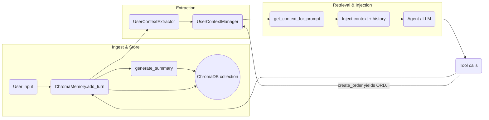

# Ontology RL Commerce Agent

[English](README.md) | [简体中文](README.zh.md)


🛍️ **Ontology RL Commerce Agent** (formerly "Ontology MCP Server") highlights the newest reinforcement-learning-driven closed loop. The system still relies on the Model Context Protocol (MCP) to combine ontology reasoning, e-commerce business logic, memory, and a Gradio UI so you can reproduce a full shopping assistant experience end-to-end.

🤖 **RL-powered Agent**: Stable Baselines3 PPO training pipeline ships in-tree. It covers the entire flow from **data → training → evaluation → deployment**, letting the Agent continually learn from real transcripts and tool logs so it automatically discovers safer, more efficient tool-chaining policies.


## 📁 Directory Structure

```
ontology-rl-commerce-agent/
├── README.md                 # English documentation
├── README.zh.md             # 中文版文档
├── pyproject.toml           # Poetry/Dependency manifest
├── requirements-dev.txt     # Dev dependencies (pytest, etc.)
├── train_rl_agent.py        # PPO training entry point (0→1 pipeline)
├── test_rl_modules.py       # RL module smoke tests
├── scripts/                 # Bootstrap & utility scripts for data/Agent
│   ├── run_server.sh        # Start MCP Server (FastAPI)
│   ├── run_agent.sh         # Launch Gradio UI
│   ├── run_training_dashboard.sh # Launch RL training dashboard (Gradio)
│   ├── run_tensorboard.sh   # Launch TensorBoard (RL logs)
│   ├── start_all.sh         # Start Server/Agent/Dashboard/TensorBoard in background
│   ├── stop_all.sh          # Stop background services and clear PID list
│   ├── init_database.py     # Initialize the 12 business tables
│   ├── seed_data.py         # Seed base users/products
│   ├── add_bulk_products.py # Generate 1000+ products
│   ├── add_bulk_users.py    # Generate 200+ users
│   ├── update_demo_user_names.py # Refresh demo user names
│   └── generate_dialogue_corpus.py # Produce 200 fully real RL scenarios
│
├── data/                    # Data assets
│   ├── ontology_commerce.ttl # 650-line commerce ontology
│   ├── ontology_shapes.ttl   # 550-line SHACL rule set
│   ├── ontology_rules.ttl    # Business inference rules
│   ├── product_synonyms.json # Product synonym dictionary
│   ├── capabilities.jsonld   # 21 MCP tool descriptions
│   ├── ecommerce.db          # SQLite commerce database
│   ├── training_dashboard/   # RL dashboard corpus cache & model registry
│   ├── training_scenarios/   # RL scenario corpus (sample_dialogues.json)
│   ├── rl_training/          # RL artifacts (models/logs/checkpoints)
│   └── chroma_memory/        # ChromaDB conversation memory store
│
├── docs/                    # Guides & reports
│   ├── PHASE3_COMPLETION_REPORT.md
│   ├── PHASE4_COMPLETION_REPORT.md
│   ├── MEMORY_CONFIG_GUIDE.md
│   ├── MEMORY_GUIDE.md
│   ├── EXECUTION_LOG_GUIDE.md
│   └── GRADIO_UI_GUIDE.md
│
├── src/
│   ├── ontology_mcp_server/  # MCP Server (FastAPI)
│   │   ├── server.py         # Main service (port 8000)
│   │   ├── config.py         # Config management
│   │   ├── capabilities.py   # Tool registration
│   │   ├── tools.py          # Tool dispatch logic
│   │   ├── ontology_service.py # Ontology reasoning service
│   │   ├── shacl_service.py  # SHACL validation service
│   │   ├── commerce_service.py # Commerce business APIs
│   │   ├── db_service.py     # Database wrapper
│   │   └── ecommerce_ontology.py # Ontology inference engine
│   │
│   ├── training_dashboard/   # RL training console (Gradio + orchestration)
│   │   ├── config.py         # YAML parser
│   │   ├── corpus_manager.py # Static/log corpus aggregation
│   │   ├── training_runner.py# train_rl_agent.py subprocess orchestration
│   │   ├── model_registry.py # Model version metadata
│   │   ├── agent_loader.py   # Push models to the live Agent
│   │   └── gradio_dashboard.py# UI and live metrics/logs
│   │
│   └── agent/                # LangChain + RL Agent
│       ├── gradio_ui.py      # Gradio UI (port 7860)
│       ├── react_agent.py    # ReAct Agent entry point
│       ├── mcp_adapter.py    # MCP tool adapter
│       ├── llm_deepseek.py   # DeepSeek/OpenAI integration
│       ├── prompts.py        # System prompt management
│       ├── conversation_state.py # 8-stage dialogue state tracker
│       ├── quality_metrics.py# Conversation quality scoring
│       ├── intent_tracker.py # Multi-turn intent classifier
│       ├── recommendation_engine.py # Personalized recommendations
│       ├── chroma_memory.py  # Chroma memory manager
│       ├── memory_config.py  # Memory configuration loader
│       ├── user_context_extractor.py # Dynamic user context extractor
│       └── rl_agent/         # Stable Baselines3 integration
│           ├── gym_env.py            # EcommerceGymEnv
│           ├── state_extractor.py    # 128-dim state encoder
│           ├── reward_calculator.py  # Multi-objective rewards
│           ├── ppo_trainer.py        # Training orchestration
│           └── __init__.py
│
├── config/                   # YAML configs (incl. training_dashboard.example.yaml)
│
├── tests/                    # Pytest suites (core/Agent/RL)
│   ├── test_commerce_service.py
│   ├── test_services.py
│   ├── test_user_context.py
│   └── ...
│
└── data/logs/, src/agent/logs/, src/ontology_mcp_server/logs/, data/training_dashboard/log_corpus/ for runtime logs and debugging
```

## 🚀 Quick Start

### Option A: Docker (Recommended)

**Requirements**
- Docker 20.10+
- Docker Compose 2.0+
- 8 GB+ RAM
- >20 GB disk space

**One-click boot**

```bash
# 1. Clone the repo
git clone <repository-url>
cd ontology-mcp-server-RL-Stable-Baselines3

# 2. Configure environment variables
cp .env.example .env
nano .env  # fill in LLM API keys

# 3. Launch all services
docker-compose up -d

# 4. Tail logs
docker-compose logs -f

# 5. Stop services
docker-compose down
```

**Service endpoints**
- **MCP Server**: http://localhost:8000
- **Agent UI**: http://localhost:7860
- **Training Dashboard**: http://localhost:7861

**Common commands**
```bash
# Restart a single service
docker-compose restart agent-ui

# Enter a container for debugging
docker exec -it ontology-agent-ui bash

# Inspect status
docker-compose ps

# Clean and rebuild (use with caution)
docker-compose down -v
docker-compose build --no-cache
docker-compose up -d
```

**GPU support (optional)**

Install `nvidia-docker`, then uncomment the GPU block in `docker-compose.yml` under `training-dashboard`.

```bash
distribution=$(. /etc/os-release; echo $ID$VERSION_ID)
curl -s -L https://nvidia.github.io/nvidia-docker/gpgkey | sudo apt-key add -
curl -s -L https://nvidia.github.io/nvidia-docker/$distribution/nvidia-docker.list | \
  sudo tee /etc/apt/sources.list.d/nvidia-docker.list
sudo apt-get update && sudo apt-get install -y nvidia-docker2
sudo systemctl restart docker
```

---

### Option B: Local Development

#### 1. Environment preparation

**Requirements**
- Python 3.10+
- 8 GB+ RAM for inference/demos (32 GB+ for RL training)
- Linux/macOS/WSL2
- GPU optional (≥12 GB VRAM NVIDIA recommended)
- >40 GB disk (database, Chroma vectors, RL checkpoints)

**Install dependencies**

```bash
git clone <repository-url>
cd ontology-mcp-server-RL-Stable-Baselines3
python3 -m venv .venv
source .venv/bin/activate  # Windows: .venv\Scripts\activate
pip install -e .
```

#### 2. Initialize the database

> Docker deployments run these steps automatically on first launch. Manual steps are for local dev only.

```bash
export ONTOLOGY_DATA_DIR="$(pwd)/data"
python scripts/init_database.py        # Create tables
python scripts/seed_data.py            # Seed base users/products
python scripts/add_bulk_products.py    # Optional: +1000 products
python scripts/add_bulk_users.py       # Optional: +200 users
python scripts/update_demo_user_names.py --seed 2025
```

**Sample users**

| User ID | Name | Email | Tier | Lifetime Spend |
|---------|------|-------|------|----------------|
| 1 | 张三 | zhangsan@example.com | Regular | ¥0 |
| 2 | 李四 | lisi@example.com | VIP | ¥6,500 |
| 3 | 王五 | wangwu@example.com | SVIP | ¥12,000 |

**Sample products**
- iPhone 15 Pro Max (¥9,999)
- iPhone 15 Pro (¥8,999)
- iPhone 15 (¥5,999)
- AirPods Pro 2 (¥1,899)
- Accessories, etc.

#### 3. Configure the LLM

`src/agent/config.yaml` supports DeepSeek, OpenAI-compatible APIs, or local Ollama:

```yaml
llm:
  provider: "deepseek"
  api_url: "https://api.deepseek.com/v1"
  api_key: "your-api-key-here"
  model: "deepseek-chat"
  temperature: 0.7
  max_tokens: 2000
```

Or via environment variables:

```bash
export OPENAI_API_URL="https://api.deepseek.com/v1"
export OPENAI_API_KEY="your-api-key"
export OPENAI_MODEL="deepseek-chat"

# Local Ollama (qwen3:8b example)
export LLM_PROVIDER="ollama"
export OLLAMA_API_URL="http://localhost:11434/v1"
export OLLAMA_MODEL="qwen3:8b"
export OLLAMA_API_KEY="ollama"  # Ollama ignores the value
```

#### 3.1 Configure MCP base URL

Both the training script (`train_rl_agent.py`) and the Gradio Agent call MCP over HTTP. Override `MCP_BASE_URL` if needed:

```bash
# Local/dev
export MCP_BASE_URL="http://127.0.0.1:8000"

# Docker/production (container-to-container)
export MCP_BASE_URL="http://ontology-mcp-server:8000"
```

#### 4. Start services

**Option 1: start_all.sh (recommended)**

```bash
./scripts/start_all.sh
# Logs are streamed to logs/<service>_yyyyMMdd_HHmmss.log
tail -f logs/server_*.log
```

Stop everything:

```bash
./scripts/stop_all.sh
```

**Option 2: Start individually**

```bash
./scripts/run_server.sh
./scripts/run_agent.sh
./scripts/run_training_dashboard.sh
./scripts/run_tensorboard.sh
```

**Option 3: Manual commands**

```bash
# Terminal 1: MCP Server (FastAPI)
source .venv/bin/activate
export ONTOLOGY_DATA_DIR="$(pwd)/data"
uvicorn ontology_mcp_server.server:app --host 0.0.0.0 --port 8000

# Terminal 2: Gradio UI
source .venv/bin/activate
export ONTOLOGY_DATA_DIR="$(pwd)/data"
export MCP_BASE_URL="http://127.0.0.1:8000"
python -m agent.gradio_ui

# Terminal 3: RL Training Dashboard
source .venv/bin/activate
export ONTOLOGY_DATA_DIR="$(pwd)/data"
export MCP_BASE_URL="http://127.0.0.1:8000"
python scripts/run_training_dashboard.py

# Terminal 4: TensorBoard
source .venv/bin/activate
tensorboard --logdir data/rl_training/logs/tensorboard --host 0.0.0.0 --port 6006
```

> To change the Gradio bind address/port, set `GRADIO_SERVER_NAME` and `GRADIO_SERVER_PORT` before launching. `run_agent.sh` / `run_training_dashboard.sh` accept `AGENT_HOST/PORT` and `TRAINING_DASHBOARD_HOST/PORT`; they forward values to Gradio environment variables to keep ports 7860/7861 independent.

### 5. Access the UI

Visit **http://127.0.0.1:7860**.

Tabs:
- **💬 Plan**: Chat interface + reasoning plan
- **🔧 Tool Calls**: Live tool invocation log
- **🧠 Memory**: Conversation memory (ChromaDB)
- **🛍️ Commerce Analytics**: Quality score, intent tracker, conversation state, recommendation engine
- **📋 Execution Log**: Full LLM I/O and tool traces

### Memory flow (Mermaid)



### 6. Sample dialogue

```
User: Hi
AI: Hello! Welcome... (intent: greeting)

User: Recommend a phone?
AI: [commerce.search_products] Returns 4 iPhone models...

User: Is iPhone 15 Pro Max in stock?
AI: [commerce.check_stock] In stock, 50 units...

User: Add to cart
AI: [commerce.add_to_cart] Added... (state: browsing → cart)
```

### 7. Optional RL loop
- `scripts/generate_dialogue_corpus.py` for the latest 200 fully real scenarios
- `python test_rl_modules.py` to sanity-check RL modules
- `python train_rl_agent.py --timesteps ...` to launch PPO training
- Details below in **🧠 Reinforcement Learning (Phase 6)**

## 🔧 MCP Server API

The MCP server exposes HTTP endpoints.

**Health Check**
```bash
curl http://localhost:8000/health
```

**Capability list**
```bash
curl http://localhost:8000/capabilities
```

**Invoke a tool**
```bash
curl -X POST http://localhost:8000/invoke \
  -H "Content-Type: application/json" \
  -d '{
    "tool": "commerce.search_products",
    "params": {
      "available_only": true,
      "limit": 5
    }
  }'
```

### 21 tools

**Ontology tools (3)**
1. `ontology.explain_discount`
2. `ontology.normalize_product`
3. `ontology.validate_order`

**Commerce tools (18)**
4. `commerce.search_products`
5. `commerce.get_product_detail`
6. `commerce.check_stock`
7. `commerce.get_product_recommendations`
8. `commerce.get_product_reviews`
9. `commerce.add_to_cart`
10. `commerce.view_cart`
11. `commerce.remove_from_cart`
12. `commerce.create_order`
13. `commerce.get_order_detail`
14. `commerce.cancel_order`
15. `commerce.get_user_orders`
16. `commerce.process_payment`
17. `commerce.track_shipment`
18. `commerce.get_shipment_status`
19. `commerce.create_support_ticket`
20. `commerce.process_return`
21. `commerce.get_user_profile`

## 🧠 Agent Architecture

### Core components

1. **ReAct Agent** (`react_agent.py`)
   - LangChain ReAct workflow (Reasoning + Acting)
   - Auto tool selection and reasoning traces
   - Multi-turn dialogue awareness

2. **Conversation State** (`conversation_state.py`)
   - 8 phases: greeting → browsing → selecting → cart → checkout → tracking → service → idle
   - Tracks VIP status, cart state, browsing history
   - Auto transition detection from keywords & tool usage

3. **System Prompts** (`prompts.py`)
   - Ecommerce persona: professional, friendly shopping advisor
   - Uses "您" tone in Chinese prompts; avoids system jargon
   - Confirms risky operations (payment, cancellation)
   - Encourages clarifying questions instead of immediate refusal

4. **Conversation Memory** (`chroma_memory.py`)
   - Backend: ChromaDB
   - Retrieval modes: `recent`, `similarity`, `hybrid`
   - Auto-summarizes each turn
   - Persisted in `data/chroma_memory/`

5. **Quality Tracking** (`quality_metrics.py`)
   - Conversation quality score (0-1)
   - User satisfaction estimation
   - Tool efficiency & latency tracking

6. **Intent Tracker** (`intent_tracker.py`)
   - 14 intents (greeting, search, view_cart, checkout, track_order, ...)
   - Confidence scores + history

7. **Recommendation Engine** (`recommendation_engine.py`)
   - Personalized product recommendations
   - Uses browsing/cart history & membership tier

## 🧠 Reinforcement Learning (Phase 6)

> **Hardware tips**: PPO training benefits from ≥8 cores, ≥32 GB RAM, and ≥1 GPU with ≥12 GB VRAM (RTX 3080/4090/A6000). CPU-only is possible but 100K steps may take 5-8 hours; GPU cuts it to ~1 hour. Reserve ≥15 GB for `data/rl_training/`.

### Goals & benefits
- Let the ReAct Agent self-improve via Stable Baselines3 PPO.
- Encode user context/intent/tool usage/product info into a 128-dim state.
- Multi-objective rewards (task success, efficiency, satisfaction, safety).
- Gymnasium environment reuses the LangChain Agent without re-implementing business logic.

### Module overview (`src/agent/rl_agent/`)
| File | Role | Notes |
|------|------|-------|
| `state_extractor.py` | Encode multi-source dialogue into 128-dim vector | Handles embeddings/simple features, tolerant of string/object intents |
| `reward_calculator.py` | Multi-objective rewards | `task/efficiency/satisfaction/safety` + episode aggregates |
| `gym_env.py` | `EcommerceGymEnv` | 22 discrete actions (21 tools + direct reply) |
| `ppo_trainer.py` | Training orchestration | DummyVecEnv + eval/checkpoint callbacks + TensorBoard |
| `train_rl_agent.py` | CLI entry | Configurable steps, eval freq, checkpoints, embeddings |

**Scenario corpus** `data/training_scenarios/sample_dialogues.json` includes 200 real conversations referencing real users/orders/products across 5 scenario categories.

### Closed loop: Data → Training → Application

1. **Data stage**
   - Ensure database is filled: `add_bulk_products.py`, `add_bulk_users.py`, `update_demo_user_names.py --seed 2025`.
   - Generate 200 real scenarios: `python scripts/generate_dialogue_corpus.py`.
   - Optional validation snippet (category counts) shown in README.zh.md.

2. **Training**
```bash
source .venv/bin/activate
export ONTOLOGY_DATA_DIR="$(pwd)/data"
export MCP_BASE_URL="http://localhost:8000"
export OPENAI_API_URL="https://api.deepseek.com/v1"
export OPENAI_API_KEY="your-api-key"
export OPENAI_MODEL="deepseek-chat"
export TRAIN_DEVICE="gpu"  # fallback to cpu
python test_rl_modules.py
python train_rl_agent.py \
  --timesteps 100000 \
  --eval-freq 2000 \
  --checkpoint-freq 20000 \
  --output-dir data/rl_training \
  --max-steps-per-episode 12 \
  --scenario-file data/training_scenarios/sample_dialogues.json \
  --device "${TRAIN_DEVICE:-gpu}"
```

Logs stream to `data/rl_training/logs/tensorboard/`.

3. **Evaluation & artifacts**
- Best model: `data/rl_training/best_model/best_model.zip`
- Final model: `data/rl_training/models/ppo_ecommerce_final.zip`
- Checkpoints: `data/rl_training/checkpoints/ppo_ecommerce_step_*.zip`
- Episode stats: `data/rl_training/logs/training_log.json`

4. **Deployment**
```bash
python - <<'PY'
from agent.react_agent import LangChainAgent
from agent.rl_agent.ppo_trainer import PPOTrainer

agent = LangChainAgent(max_iterations=6)
trainer = PPOTrainer(agent, output_dir="data/rl_training")
trainer.create_env(max_steps_per_episode=10)
trainer.load_model("data/rl_training/best_model/best_model.zip")

query = "I need ten flagship Huawei phones, budget around 7000"
action_idx, action_name, _ = trainer.predict(query)
print("RL suggested action:", action_idx, action_name)

result = agent.run(query)
print(result["final_answer"])
PY
```

### RL dashboard (Gradio)

`src/training_dashboard/` offers a self-contained console with corpus aggregation, training orchestration, metric visualization, model registry, and hot reload:

1. Copy `config/training_dashboard.example.yaml` → `config/training_dashboard.yaml` and adjust paths.
2. Launch via `PYTHONPATH=src python scripts/run_training_dashboard.py`.
3. Tabs: overview (live status, reward/length curves, logs), corpus management (static/log mixes), training control, model management.

### Reward breakdown
- `R_task`: +10 for successful orders; missing key info or empty replies deduct.
- `R_efficiency`: Fewer tool calls & low latency rewarded; excessive calls penalized.
- `R_satisfaction`: Uses live quality score to reward proactive guidance.
- `R_safety`: Starts at +1; SHACL failures or unsafe tools subtract up to 10.

### Tuning tips
- Enable `--use-text-embedding` if resources allow for richer states.
- Adjust `reward_weights` in `PPOTrainer` to balance success vs. safety.
- `max_steps_per_episode`: Short episodes for frequent eval; longer for complete shopping journeys.

## 🎯 Ontology Rule Coverage

100% of `ontology_rules.ttl` is implemented in `ecommerce_ontology.py`.

### User tier rules (2)
| Rule | Trigger | Method |
|------|---------|--------|
| VIPUpgradeRule | Total spend ≥ 5000 | `infer_user_level()` |
| SVIPUpgradeRule | Total spend ≥ 10000 | `infer_user_level()` |

### Discount rules (5)
| Rule | Trigger | Discount | Method |
|------|---------|----------|--------|
| VIPDiscountRule | VIP users | 95% | `infer_discount()` |
| SVIPDiscountRule | SVIP users | 90% | `infer_discount()` |
| VolumeDiscount5kRule | Order ≥ 5000 | 95% | `infer_discount()` |
| VolumeDiscount10kRule | Order ≥ 10000 | 90% | `infer_discount()` |
| FirstOrderDiscountRule | First-time buyers | 98% | `infer_discount()` |

> Membership discounts and volume discounts do not stack—best discount wins.

### Shipping rules (5)
| Rule | Trigger | Shipping | Method |
|------|---------|----------|--------|
| FreeShipping500Rule | Order ≥ 500 | ¥0 standard | `infer_shipping()` |
| VIPFreeShippingRule | VIP/SVIP | ¥0 standard | `infer_shipping()` |
| SVIPNextDayDeliveryRule | SVIP | ¥0 next-day | `infer_shipping()` |
| StandardShippingRule | Regular < 500 | ¥15 standard | `infer_shipping()` |
| RemoteAreaShippingRule | Remote address | +¥30 | `infer_shipping()` |

### Return/exchange rules (5)
| Rule | Scope | Window | Extra conditions |
|------|-------|--------|------------------|
| Standard7DayReturnRule | Regular users | 7 days | No reason needed |
| VIP15DayReturnRule | VIP/SVIP | 15 days | No reason |
| ElectronicReturnRule | Electronics | Tier-based | Device unopened |
| AccessoryReturnRule | Accessories | Tier-based | Packaging intact |
| ServiceNoReturnRule | Services | N/A | Not returnable |

### Combo strategies (2)
| Strategy | Scenario | Behavior |
|----------|----------|----------|
| DiscountStackingStrategy | Multiple discounts | Picks optimal |
| ShippingPriorityStrategy | Multiple shipping options | Applies priority |

### SHACL validation

`commerce_service.py` calls SHACL validation before creating orders to ensure data integrity, logging top violations and triple counts.

## 📊 Gradio UI Features

- **💬 Plan**: Input area, AI response, reasoning plan, live state.
- **🔧 Tool Calls**: Tool names/params, timestamps, results, errors.
- **🧠 Memory**: History list, summaries, retrieval controls, session management.
- **🛍️ Commerce Analytics**: Quality metrics, intent analysis, conversation state, recommendation engine.
- **📋 Execution Log**: Full LLM input/output and tool traces.

## 📚 Documentation

- [Phase 3 Completion Report](./docs/PHASE3_COMPLETION_REPORT.md)
- [Phase 4 Completion Report](./docs/PHASE4_COMPLETION_REPORT.md)
- [Memory Guide](./MEMORY_GUIDE.md)
- [Memory Config Guide](./docs/MEMORY_CONFIG_GUIDE.md)
- [Execution Log Guide](./docs/EXECUTION_LOG_GUIDE.md)
- [Gradio UI Guide](./GRADIO_UI_GUIDE.md)
- [Agent Usage Guide](./AGENT_USAGE.md)

## 🧪 Testing

```bash
source .venv/bin/activate
python test_memory_quick.py
python test_execution_log.py
python test_phase4_shopping.py
python test_phase4_advanced.py
python test_gradio_ecommerce.py
python test_rl_modules.py

pytest tests/
pytest tests/test_services.py
pytest tests/test_commerce_service.py
python train_rl_agent.py --timesteps 20000 --eval-freq 2000 --checkpoint-freq 5000
```

## ⚙️ Configuration

### Environment variables

**MCP / Data root**
```bash
export ONTOLOGY_DATA_DIR="$(pwd)/data"
export APP_HOST=0.0.0.0
export APP_PORT=8000
export ONTOLOGY_USE_OWLREADY2=false
```

**Agent & LLM**
```bash
export MCP_BASE_URL="http://127.0.0.1:8000"
export OPENAI_API_URL="https://api.deepseek.com/v1"
export OPENAI_API_KEY="your-api-key"
export OPENAI_MODEL="deepseek-chat"
export LLM_PROVIDER="deepseek"
```

**Gradio services**
```bash
export GRADIO_SERVER_NAME=0.0.0.0
export GRADIO_SERVER_PORT=7860
export AGENT_HOST=0.0.0.0
export AGENT_PORT=7860
export TRAINING_DASHBOARD_HOST=0.0.0.0
export TRAINING_DASHBOARD_PORT=7861
export LOG_DIR="$(pwd)/logs"
export TB_LOG_DIR="$(pwd)/data/rl_training/logs/tensorboard"
export TB_HOST=0.0.0.0
export TB_PORT=6006
```

**RL helpers**
```bash
export TRAIN_DEVICE=gpu
export RL_OUTPUT_DIR="$(pwd)/data/rl_training"
```

**Memory**
```bash
export MEMORY_ENABLED=true
export MEMORY_BACKEND=chromadb
export CHROMA_PERSIST_DIR="data/chroma_memory"
export MEMORY_RETRIEVAL_MODE=recent
export MEMORY_MAX_TURNS=10
```

### config.yaml example

See `src/agent/config.yaml` for complete options (DeepSeek/Ollama, memory, agent toggles).

## 🗄️ Database Schema

SQLite DB `data/ecommerce.db` contains 12 tables:
- `users`, `products`, `cart_items`, `orders`, `order_items`
- `payments`, `shipments`, `shipment_tracks`
- `support_tickets`, `support_messages`, `returns`, `reviews`

## 🎯 Use Cases

1. **Search & recommendation**: `commerce.search_products` + recommendation engine.
2. **Full purchase flow**: browsing → selecting → cart → checkout → payment → tracking.
3. **Order management**: `commerce.get_user_orders`, cancel/return flows.
4. **Ontology reasoning**: `ontology.explain_discount` for contextual discount explanation.

## 🤝 Contributing

1. Fork the project
2. `git checkout -b feature/AmazingFeature`
3. `git commit -m 'Add some AmazingFeature'`
4. `git push origin feature/AmazingFeature`
5. Open a Pull Request

## 🏷️ Release Highlights

### v1.5.1 (2025-11-23) — Latest
- Inline charts (Markdown + Base64 PNG) with intent/user-context metadata and `_filter_charts_by_intent()` privacy guard.
- `analytics_service.py` with five chart data endpoints + `analytics_get_chart_data` MCP tool (22nd capability).
- Dependency alignment: `plotly>=6.1.0,<7.0.0`, `kaleido==0.2.1`; diagnostic scripts (`verify_chart_fix.py`, `test_chart_feature.py`) and data/log backups.
- Training dashboard UX: click-to-preview corpus, synchronized JSON view, host/port logs for multi-instance debugging.

### v1.2.3 (2025-11-15) — Renaming & acknowledgments
- Rebranded to **Ontology RL Commerce Agent**; documented RL context.
- Added acknowledgments for Stable Baselines3/Gymnasium/TensorBoard, etc.
- Tooling: order ID validation to avoid `OverflowError`; Ollama support for `qwen3:8b`.

### v1.2.2 (2025-11-12) — README RL guide
- Added RL closed-loop description early in the README and emphasized data→training→TensorBoard→deployment.

### v1.2.0 (2025-11-11) — Dynamic user context system
- Automatic extraction of user IDs, phone numbers, addresses, order IDs, product IDs.
- Prompt injection ensures continuity; regex engine handles multilingual/width variants.
- Set-based deduplication, strict `ORD...` validation, product ID range guard.
- Tests: `tests/test_user_context.py`.

### v1.2.1 (2025-11-11) — Recent order tracking hotfix
- `create_order` now forces observation/input parsing for valid `ORD...` IDs, calling `set_recent_order()`.

### v1.1.0 (2025-11-10) — Gradio UI enhancements
- Ten quick-test buttons (ontology & SHACL actions).
- Streaming responses, proactive button state management, generator fixes.

### v1.0.0 (2025-11-08) — Order validation baseline
- Automatic SHACL validation before order creation; detailed violation logging.
- Prompt improvements and 100% rule coverage (discount/shipping/returns/combination).

### Base Version (2025-10)
- Phases 1-5 complete: ORM, ontology, 21 tools, ReAct Agent, Gradio UI.

## 📝 Changelog

See [README.zh.md](README.zh.md#-更新日志) for the detailed Chinese changelog (mirrors the English highlights above).

## 🙏 Acknowledgments

- **LangChain & FastAPI** – ReAct agent orchestration + MCP server.
- **Gradio** – Five-tab ecommerce UI shell.
- **ChromaDB & SQLite** – Semantic memory + commerce data.
- **Stable Baselines3 / Gymnasium / TensorBoard** – RL training & visualization.
- **DeepSeek** – LLM provider.
- **RDFLib & PySHACL** – Ontology reasoning + SHACL validation.
- **SQLAlchemy** – ORM foundation.

## 📖 Citation

```
@software{ontology_rl_commerce_agent_2025,
  author  = {Shark8848},
  title   = {Ontology RL Commerce Agent},
  year    = {2025},
  url     = {https://github.com/shark8848/ontology-mcp-server-RL-Stable-Baselines3},
  version = {v1.2.3}
}
```

## 📄 License

Released under the [MIT License](LICENSE). A Simplified Chinese reference translation is available in [LICENSE.zh.md](LICENSE.zh.md).

## 📧 Contact

Author: shark8848@gmail.com — please star the repo if it helps you!
