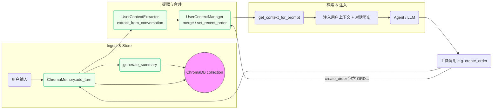
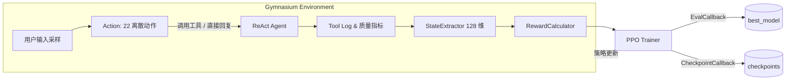

# Ontology RL Commerce Agent

[English](README.md) | [简体中文](README.zh.md)


🛍️ **Ontology RL Commerce Agent（原名 Ontology MCP Server）**，为了突出最新的强化学习自进化闭环能力，对项目名称进行了升级；系统依旧基于 MCP (Model Context Protocol) 架构融合本体推理、电商业务逻辑、记忆系统与 Gradio UI，可直接复现完整购物体验。

🤖 **强化学习驱动的 Agent**：项目内置 Stable Baselines3 PPO 训练管线，从 **数据 → 训练 → 评估 → 部署** 完整闭环出发，支持 Agent 在真实语料与工具调用日志上持续自我迭代，自动学会更高效、更安全的工具编排策略。


## 🚀 快速开始

### 方式 A：Docker 部署（推荐）

**系统要求**:
- Docker 20.10+
- Docker Compose 2.0+
- 8GB+ RAM
- 磁盘：>20GB 可用空间

**一键启动**:

```bash
# 1. 克隆仓库
git clone <repository-url>
cd ontology-mcp-server-RL-Stable-Baselines3

# 2. 配置环境变量
cp .env.example .env
# 编辑 .env 文件，填入 LLM API Key
nano .env  # 或使用其他编辑器

# 3. 启动所有服务
docker-compose up -d

# 4. 查看日志
docker-compose logs -f

# 5. 停止服务
docker-compose down
```

**服务访问**:
- **MCP Server**: http://localhost:8000
- **Agent UI**: http://localhost:7860
- **Training Dashboard**: http://localhost:7861

**常用命令**:
```bash
# 重启单个服务
docker-compose restart agent-ui

# 进入容器调试
docker exec -it ontology-agent-ui bash

# 查看服务状态
docker-compose ps

# 清理并重建（慎用）
docker-compose down -v
docker-compose build --no-cache
docker-compose up -d
```

**GPU 支持（可选）**:

如需在 Docker 中使用 GPU 进行 RL 训练，需安装 `nvidia-docker` 并在 `docker-compose.yml` 中取消注释 GPU 配置段：

```bash
# 安装 nvidia-docker
distribution=$(. /etc/os-release;echo $ID$VERSION_ID)
curl -s -L https://nvidia.github.io/nvidia-docker/gpgkey | sudo apt-key add -
curl -s -L https://nvidia.github.io/nvidia-docker/$distribution/nvidia-docker.list | \
  sudo tee /etc/apt/sources.list.d/nvidia-docker.list
sudo apt-get update && sudo apt-get install -y nvidia-docker2
sudo systemctl restart docker

# 启用 GPU（编辑 docker-compose.yml）
# 取消注释 training-dashboard 服务的 deploy.resources 部分
```

---

### 方式 B：本地开发部署

### 1. 环境准备

**系统要求**:
- Python 3.10+
- 8GB+ RAM (推理/演示足够；若执行 RL 训练建议 32GB+)
- Linux/macOS/WSL2
- GPU (可选)：建议使用至少 1 块 12GB 显存的 NVIDIA CUDA GPU；若无 GPU，可在 CPU 上训练但需显著更长时间
- 磁盘：>40GB 可用空间（数据库、Chroma 向量库、RL 模型检查点）

**安装依赖**:

```bash
# 克隆仓库
git clone <repository-url>
cd ontology-mcp-server-RL-Stable-Baselines3

# 创建虚拟环境
python3 -m venv .venv
source .venv/bin/activate  # Windows: .venv\Scripts\activate

# 安装依赖（包含 LangChain, Gradio, ChromaDB 等）
pip install -e .
```

### 2. 初始化数据库

> **注意**：Docker 部署会在首次启动时自动执行初始化，无需手动操作。以下步骤仅适用于本地开发部署。

```bash
# 在虚拟环境中执行
export ONTOLOGY_DATA_DIR="$(pwd)/data"

# 创建数据库表结构（12张表）
python scripts/init_database.py

# 填充测试数据（5个用户 + 8个商品）
python scripts/seed_data.py

# 批量扩展商品与用户（可选）
python scripts/add_bulk_products.py
python scripts/add_bulk_users.py

# 随机刷新示例用户姓名（可选）
python scripts/update_demo_user_names.py --seed 2025
```

**创建的测试用户**:
| 用户ID | 姓名 | 邮箱 | 等级 | 累计消费 |
|--------|------|------|------|---------|
| 1 | 张三 | zhangsan@example.com | Regular | ¥0 |
| 2 | 李四 | lisi@example.com | VIP | ¥6,500 |
| 3 | 王五 | wangwu@example.com | SVIP | ¥12,000 |

**创建的测试商品**:
- iPhone 15 Pro Max (¥9999)
- iPhone 15 Pro (¥8999)
- iPhone 15 (¥5999)
- AirPods Pro 2 (¥1899)
- 等配件商品...

### 3. 配置 LLM

在 `src/agent/config.yaml` 中配置 LLM（支持 DeepSeek、OpenAI 兼容 API，或本地 Ollama）：

```yaml
llm:
  provider: "deepseek"
  api_url: "https://api.deepseek.com/v1"
  api_key: "your-api-key-here"
  model: "deepseek-chat"
  temperature: 0.7
  max_tokens: 2000
```

或使用环境变量：

```bash
export OPENAI_API_URL="https://api.deepseek.com/v1"
export OPENAI_API_KEY="your-api-key"
export OPENAI_MODEL="deepseek-chat"

# 切换到本地 Ollama（qwen3:8b）
export LLM_PROVIDER="ollama"
export OLLAMA_API_URL="http://localhost:11434/v1"
export OLLAMA_MODEL="qwen3:8b"
# Ollama 不校验密钥，任何非空值即可
export OLLAMA_API_KEY="ollama"

# 确保本地已运行 `ollama serve` 且镜像存在：
#   ollama pull qwen3:8b
#   ollama run qwen3:8b --keepalive 5m
```

### 3.1 配置 MCP 服务地址

训练脚本 (`train_rl_agent.py`) 与 Gradio Agent 都通过 HTTP 调用 MCP Server；其地址由 `MCP_BASE_URL` 控制，默认指向 `http://localhost:8000`。你可以通过以下任意方式覆盖：

```bash
# 本地/开发环境
export MCP_BASE_URL="http://127.0.0.1:8000"

# Docker Compose / 生产环境（容器间通信）
export MCP_BASE_URL="http://ontology-mcp-server:8000"

# 或在 src/agent/config.yaml 中设置：
# MCP_BASE_URL: http://localhost:8000
```

无论是直接运行 `python train_rl_agent.py` 还是使用训练控制台，都会读取同一变量，因此确保该地址能够访问正在运行的 MCP Server。

### 4. 启动服务

**方式一：一键后台启动（推荐）**

```bash
# 后台启动 Server / Agent / Training Dashboard / TensorBoard
./scripts/start_all.sh

# 实时查看任一服务日志
tail -f logs/server_*.log
```

- 所有脚本采用 `nohup` + 后台模式运行，并将输出写入 `logs/<service>_yyyyMMdd_HHmmss>.log`。
- `LOG_DIR` 环境变量可自定义日志目录（默认 `logs/`）。
- 进程信息会记录在 `logs/processes.pid`，便于统一停止。
- 一键停止全部服务：

```bash
./scripts/stop_all.sh
```

`stop_all.sh` 会遍历 `processes.pid` 中的 PID，先尝试优雅退出，必要时发送 `SIGKILL`，最后清空 PID 文件。

**方式二：分别启动（便于独立调试）**

***MCP 服务器***
```
./scripts/run_server.sh
```
***Gradio UI***
```
./scripts/run_agent.sh
```
***RL 训练控制台***
```
./scripts/run_training_dashboard.sh
```
***TensorBoard***
```
./scripts/run_tensorboard.sh
```

**方式三：手动启动**

```bash
# 终端 1: MCP 服务器 (FastAPI)
source .venv/bin/activate
export ONTOLOGY_DATA_DIR="$(pwd)/data"
uvicorn ontology_mcp_server.server:app --host 0.0.0.0 --port 8000

# 终端 2: Gradio UI (客户对话界面)
source .venv/bin/activate
export ONTOLOGY_DATA_DIR="$(pwd)/data"
export MCP_BASE_URL="http://127.0.0.1:8000"   # 指向正在运行的 MCP Server
python -m agent.gradio_ui

# 终端 3: RL 训练控制台 (Gradio)
source .venv/bin/activate
export ONTOLOGY_DATA_DIR="$(pwd)/data"
export MCP_BASE_URL="http://127.0.0.1:8000"
python scripts/run_training_dashboard.py

# 终端 4: TensorBoard (RL 训练日志)
source .venv/bin/activate
tensorboard --logdir data/rl_training/logs/tensorboard --host 0.0.0.0 --port 6006
```

> 如果需要在手动模式下指定 Gradio 监听地址/端口，可在运行脚本前设置 `GRADIO_SERVER_NAME=0.0.0.0` 并调整 `GRADIO_SERVER_PORT`。使用 `run_agent.sh` / `run_training_dashboard.sh` 时，可改写 `AGENT_HOST/AGENT_PORT` 与 `TRAINING_DASHBOARD_HOST/TRAINING_DASHBOARD_PORT`，脚本会自动把它们注入对应的 Gradio 环境变量，保持 7860/7861 默认解耦。

### 5. 访问界面

打开浏览器访问 **http://127.0.0.1:7860**

Gradio UI 提供 5 个 Tab：
- **💬 Plan**: 对话界面 + Agent 推理计划
- **🔧 Tool Calls**: 实时工具调用记录
- **🧠 Memory**: 对话记忆管理（ChromaDB）
- **🛍️ 电商分析**: 质量评分、意图识别、状态跟踪、推荐引擎
- **📋 Execution Log**: 完整执行日志（LLM 输入输出、工具调用详情）

### Memory 模块流程图 (Mermaid)

下面的流程图展示了 `memory` 模块（`ChromaConversationMemory`）的主要数据流：用户输入如何成为一条对话记录、如何提取并更新用户上下文、以及如何将用户上下文注入到下一次的 prompt 中。




### 6. 测试对话

在 Gradio 界面输入：

```
用户: 你好
AI: 您好！欢迎光临... (识别意图: greeting)

用户: 有什么手机推荐吗
AI: [调用 commerce.search_products] 为您找到 4 款 iPhone...

用户: iPhone 15 Pro Max 有货吗
AI: [调用 commerce.check_stock] 有货，库存 50 台...

用户: 加入购物车
AI: [调用 commerce.add_to_cart] 已添加... (状态: browsing → cart)
```

### 7. （可选）启用强化学习闭环
- 使用 `scripts/generate_dialogue_corpus.py` 生成最新对话语料（200 条，全部来源于真实订单/商品/用户）
- 执行 `python test_rl_modules.py` 确认环境
- 运行 `python train_rl_agent.py --timesteps ...` 启动 PPO 训练
- 训练及部署方法详见下文“🧠 强化学习自进化 (Phase 6)”章节

## 🔧 MCP Server API

MCP 服务器提供 HTTP 接口供 Agent 或其他客户端调用。

### 端点说明

**健康检查**:
```bash
curl http://localhost:8000/health
```
响应:
```json
{
  "status": "ok",
  "timestamp": "2025-11-11T08:00:00Z",
  "use_owlready2": true,
  "ttl_path": "/path/to/ontology_commerce.ttl",
  "shapes_path": "/path/to/ontology_shapes.ttl"
}
```

**获取能力列表**:
```bash
curl http://localhost:8000/capabilities
```
响应: 返回 21 个工具的能力描述（JSON-LD 格式）

**调用工具**:
```bash
curl -X POST http://localhost:8000/invoke \
  -H "Content-Type: application/json" \
  -d '{
    "tool": "commerce.search_products",
    "params": {
      "available_only": true,
      "limit": 5
    }
  }'
```

### 21 个工具列表

**本体推理工具** (3个):
1. `ontology.explain_discount` - 折扣规则解释
2. `ontology.normalize_product` - 商品名称归一化
3. `ontology.validate_order` - 订单 SHACL 校验

**电商业务工具** (18个):
4. `commerce.search_products` - 搜索商品
5. `commerce.get_product_detail` - 商品详情
6. `commerce.check_stock` - 库存查询
7. `commerce.get_product_recommendations` - 智能推荐
8. `commerce.get_product_reviews` - 商品评价
9. `commerce.add_to_cart` - 加入购物车
10. `commerce.view_cart` - 查看购物车
11. `commerce.remove_from_cart` - 移除购物车
12. `commerce.create_order` - 创建订单
13. `commerce.get_order_detail` - 订单详情
14. `commerce.cancel_order` - 取消订单
15. `commerce.get_user_orders` - 用户订单列表
16. `commerce.process_payment` - 处理支付
17. `commerce.track_shipment` - 物流追踪
18. `commerce.get_shipment_status` - 物流状态
19. `commerce.create_support_ticket` - 创建客服工单
20. `commerce.process_return` - 处理退换货
21. `commerce.get_user_profile` - 用户信息

## 🧠 AI Agent 架构

### 核心组件

**1. ReAct Agent** (`react_agent.py`)
- 基于 LangChain 的 ReAct (Reasoning + Acting) 模式
- 自动选择工具并进行推理
- 支持多轮对话和上下文理解

**2. 对话状态管理** (`conversation_state.py`)
- **8 个对话阶段**: greeting → browsing → selecting → cart → checkout → tracking → service → idle
- **用户上下文跟踪**: VIP 身份、购物车状态、浏览历史
- **自动阶段推断**: 基于关键词和工具调用自动识别对话进展

**3. 系统提示词** (`prompts.py`)
- 电商专用角色定位："专业、友好的购物顾问"
- 对话风格指导：使用"您"称呼，避免系统术语
- 关键操作确认：支付、取消订单前主动确认
- 主动引导：询问补充信息而非直接拒绝

**4. 对话记忆** (`chroma_memory.py`)
- **后端**: ChromaDB 向量数据库
- **检索模式**: 
  - `recent`: 最近 N 条对话
  - `similarity`: 语义相似度检索
  - `hybrid`: 混合模式
- **自动摘要**: 每轮对话生成简洁摘要
- **持久化**: 数据保存在 `data/chroma_memory/`

**5. 质量跟踪** (`quality_metrics.py`)
- 对话质量评分（0-1）
- 用户满意度估算
- 工具使用效率统计
- 响应速度跟踪

**6. 意图识别** (`intent_tracker.py`)
- 14 种意图类型：greeting, search, view_cart, checkout, track_order 等
- 置信度评分
- 意图历史记录
- 意图转移分析

**7. 推荐引擎** (`recommendation_engine.py`)
- 个性化商品推荐
- 基于浏览历史和购物车
- 会员等级优惠提示
- 相关商品关联

## 🧠 强化学习自进化 (Phase 6)

> **硬件建议**：PPO 训练阶段建议使用 8+ 核 CPU、32GB 以上内存，以及至少 1 块 12GB 显存的 NVIDIA GPU（如 RTX 3080/4090 或 A6000）。在纯 CPU 环境下也可运行，但训练 100K step 可能耗时 5-8 小时；使用 GPU 可将训练时间压缩到 1 小时以内。请预留 15GB 以上磁盘空间用于 `data/rl_training/` 日志与模型检查点。

### 目标与收益
- 让 ReAct Agent 通过 Stable Baselines3 PPO 离线自我改进，减少人工 prompt 调参
- 以 128 维状态向量统一描述用户上下文、意图、工具调用与商品状态
- 多目标奖励函数同时约束任务成功率、效率、满意度与安全合规
- 通过 Gymnasium 环境复用 LangChain Agent，避免重写业务逻辑

### 模块概览 (`src/agent/rl_agent/`)
| 文件 | 作用 | 关键点 |
| --- | --- | --- |
| `state_extractor.py` | 将多源对话数据编码为 128 维状态 | 支持文本嵌入/简单特征，容错意图字符串或对象 |
| `reward_calculator.py` | 多目标奖励 | `task/efficiency/satisfaction/safety` 4 组件 + Episode 汇总 |
| `gym_env.py` | `EcommerceGymEnv` | 22 个离散动作（21 工具 + 直接回复），自动构造步骤奖励 |
| `ppo_trainer.py` | 训练编排 | DummyVecEnv + Eval/Checkpoint 回调 + TensorBoard 日志 |
| `train_rl_agent.py` | CLI 入口 | 可配置步数 / 评估频率 / 检查点 / 文本嵌入 |

**示例对话脚本 + 用户模拟**

- `data/training_scenarios/sample_dialogues.json`：200 组对话（100% 引用真实用户手机号、真实订单号与真实商品），按 `transaction_success / consultation / issue / customer_service / return` 5 类场景分布，并将真实订单金额、物流地址、支付状态写入 `metadata.order`，训练时可直接对接 1000+ 商品与 200 名用户。

### 端到端 0→1 闭环：数据 → 训练 → 应用

#### 1. 数据阶段：构建真实语料
1. **填充数据库**（如尚未执行）：
  ```bash
  source .venv/bin/activate
  export ONTOLOGY_DATA_DIR="$(pwd)/data"
  python scripts/add_bulk_products.py
  python scripts/add_bulk_users.py
  python scripts/update_demo_user_names.py --seed 2025
  ```
2. **生成 200 条全真实语料**：
  ```bash
  python scripts/generate_dialogue_corpus.py
  ```
  输出位于 `data/training_scenarios/sample_dialogues.json`，`summary.categories` 会自动给出配额。如需自定义数量，可调整脚本顶部常量再运行；脚本默认只采样真实数据库用户/订单/商品，不再生成虚构 persona。
3. **快速校验语料**（可选）：
  ```bash
  python - <<'PY'
  import json
  from collections import Counter
  data=json.load(open('data/training_scenarios/sample_dialogues.json'))
  print('total', len(data['scenarios']))
  print('categories', Counter(s['category'] for s in data['scenarios']))
  PY
  ```

#### 2. 训练阶段：Stable Baselines3 PPO
```bash
source .venv/bin/activate
export ONTOLOGY_DATA_DIR="$(pwd)/data"
export MCP_BASE_URL="http://localhost:8000"        # 指向正在运行的 MCP Server
export OPENAI_API_URL="https://api.deepseek.com/v1"
export OPENAI_API_KEY="your-api-key"
export OPENAI_MODEL="deepseek-chat"
export TRAIN_DEVICE="gpu"                           # 如需强制 CPU 可改为 cpu
python test_rl_modules.py                # 训练前自检
python train_rl_agent.py \
  --timesteps 100000 \
  --eval-freq 2000 \
  --checkpoint-freq 20000 \
  --output-dir data/rl_training \
  --max-steps-per-episode 12 \
  --scenario-file data/training_scenarios/sample_dialogues.json \
  --device "${TRAIN_DEVICE:-gpu}"
```
训练日志实时写入 `data/rl_training/logs/tensorboard/`，可通过 `tensorboard --logdir data/rl_training/logs/tensorboard` 观察奖励、loss、评估曲线。

> `--scenario-file` 参数可将任意符合 `{ "scenarios": [...] }` 结构的语料注入训练流程。若不指定，则默认读取 `data/training_scenarios/sample_dialogues.json`。

#### 3. 评估与模型产物
- 最佳模型：`data/rl_training/best_model/best_model.zip`
- 最终模型：`data/rl_training/models/ppo_ecommerce_final.zip`
- 检查点：`data/rl_training/checkpoints/ppo_ecommerce_step_*.zip`
- Episode 统计：`data/rl_training/logs/training_log.json`

运行离线评估：
```bash
python - <<'PY'
from agent.react_agent import LangChainAgent
from agent.rl_agent.ppo_trainer import PPOTrainer

agent = LangChainAgent()
trainer = PPOTrainer(agent, output_dir="data/rl_training")
trainer.create_env()
trainer.load_model("data/rl_training/models/ppo_ecommerce_final.zip")
print(trainer.evaluate(n_eval_episodes=5))
PY
```

#### 4. 应用阶段：接入 ReAct Agent
```bash
python - <<'PY'
from agent.react_agent import LangChainAgent
from agent.rl_agent.ppo_trainer import PPOTrainer
from agent.rl_agent.gym_env import EcommerceGymEnv

agent = LangChainAgent(max_iterations=6)
trainer = PPOTrainer(agent, output_dir="data/rl_training")
trainer.create_env(max_steps_per_episode=10)
trainer.load_model("data/rl_training/best_model/best_model.zip")

query = "我想买 10 台华为旗舰机，预算 7000 左右"
action_idx, action_name, _ = trainer.predict(query)
print("RL 建议动作:", action_idx, action_name)

if action_name == "direct_reply":
   print(agent.run(query)["final_answer"])
else:
   # 可将动作写入系统 prompt 或直接执行对应工具
   result = agent.run(query)
   print(result["final_answer"]) 
PY
```
常见集成方式：
1. **策略提示**：把 `action_name` 作为系统提示，提示 LLM 优先执行该类操作。
2. **自动调度**：若动作对应 MCP 工具，则直接调用工具并把结果反馈给 LLM，只在需要自然语言回复时调用 LLM。
3. **在线回放**：记录 `action_idx` 与最终结果，定期将真实日志重新生成语料后继续训练，实现闭环迭代。

#### 5. 回放与再训练
只需替换 `sample_dialogues.json` 或追加新的语料文件，然后重复“训练阶段”命令即可。`train_rl_agent.py` 在检测到现有模型后，会自动继续训练并写入新的 checkpoints（可更换 `--output-dir` 保存多套策略）。

### 🖥️ RL 训练控制台（Gradio）

`src/training_dashboard/` 模块提供了一套独立的 Gradio 控制台，覆盖语料聚合、训练调度、指标可视化、模型回收以及一键加载 Agent，方便在无人值守的环境中运行 RL 闭环。

1. **准备配置**：复制示例配置并根据需要修改路径/阈值。
  ```bash
  cp config/training_dashboard.example.yaml config/training_dashboard.yaml
  # 编辑 config/training_dashboard.yaml 调整日志路径、语料源、训练输出等
  ```
2. **启动控制台**：
  ```bash
  source .venv/bin/activate
    PYTHONPATH=src python scripts/run_training_dashboard.py
  ```
  默认运行在 `http://127.0.0.1:7860`（如端口被占用会自动递增，终端会显示最终访问地址）。
3. **功能概览**：
  - **概览**：实时查看训练状态、最新指标、奖励/长度曲线以及原始日志；日志文本框每 3 秒自动滚动刷新，状态刷新按钮会读取 `data/rl_training/logs/training_log.json` 并生成折线图。
  - **语料管理**：配置静态语料清单、周期性提炼服务端日志，支持一键手动提炼与静态/日志语料混合导出；系统会生成合并后的 `combined_*.json` 并作为 `--scenario-file` 输入。
  - **训练控制**：可视化调整步数、评估频率、Episode 长度、文本嵌入开关以及语料来源，点击“启动训练”即调用 `train_rl_agent.py` 并自动传入最新语料路径。
  - **模型管理**：列出现有训练产物（best/final），查看元数据，选择版本后推送到 `data/rl_training/active_model/`，供在线 Agent 热加载。

> 日志提炼调度器会在后台以守护线程运行，关闭控制台或终止进程时会自动停止。训练日志在内存中保留最近约 2000 行，可配合 3 秒刷新频率查看连续输出，便于实时排查训练异常。

### 奖励分解
- `任务完成 (R_task)`：+10 奖励成功下单；关键信息缺失或响应为空即扣分
- `效率 (R_efficiency)`：鼓励少量工具调用与低延迟；调用过多或超时扣分
- `满意度 (R_satisfaction)`：结合实时质量分，奖励主动引导、降低澄清率
- `安全合规 (R_safety)`：默认 +1，检测异常日志、SHACL 失败或危险工具误用时 -10 ~ -0.5

### 训练循环示意 (Mermaid)



### 常见调优建议
- `--use-text-embedding`：资源允许时开启，可让状态表征更细腻
- `reward_weights`：在 `PPOTrainer` 初始化时传入，快速平衡任务成功率 vs. 安全
- `max_steps_per_episode`：缩短 Episode 有助于高频评估，拉长可鼓励完整购物链路

> 如需离线复现实验，可在 `data/rl_training/logs/tensorboard` 运行 `tensorboard --logdir <path>` 查看奖励曲线和策略收敛情况。

## 🎯 本体推理规则覆盖率

### 规则覆盖情况

本项目实现了 **100% 的本体规则覆盖**，所有在 `ontology_rules.ttl` 中定义的业务规则均已在 `ecommerce_ontology.py` 中完整实现。

#### 1️⃣ 用户等级规则 (2条) ✅ 100%
| 规则名称 | 触发条件 | 实现方法 | 状态 |
|---------|---------|---------|------|
| VIPUpgradeRule | 累计消费 ≥ 5000 | `infer_user_level()` | ✅ |
| SVIPUpgradeRule | 累计消费 ≥ 10000 | `infer_user_level()` | ✅ |

#### 2️⃣ 折扣规则 (5条) ✅ 100%
| 规则名称 | 触发条件 | 折扣率 | 实现方法 | 状态 |
|---------|---------|--------|---------|------|
| VIPDiscountRule | 用户等级 = VIP | 95% | `infer_discount()` | ✅ |
| SVIPDiscountRule | 用户等级 = SVIP | 90% | `infer_discount()` | ✅ |
| VolumeDiscount5kRule | 订单金额 ≥ 5000 | 95% | `infer_discount()` | ✅ |
| VolumeDiscount10kRule | 订单金额 ≥ 10000 | 90% | `infer_discount()` | ✅ |
| FirstOrderDiscountRule | 首单用户 | 98% | `infer_discount()` | ✅ |

**折扣叠加策略**: 会员折扣与批量折扣不可叠加，系统自动选择优惠力度最大的折扣。

#### 3️⃣ 物流规则 (5条) ✅ 100%
| 规则名称 | 触发条件 | 运费 | 配送方式 | 实现方法 | 状态 |
|---------|---------|------|---------|---------|------|
| FreeShipping500Rule | 订单金额 ≥ 500 | 0元 | 标准 | `infer_shipping()` | ✅ |
| VIPFreeShippingRule | VIP/SVIP用户 | 0元 | 标准 | `infer_shipping()` | ✅ |
| SVIPNextDayDeliveryRule | SVIP用户 | 0元 | 次日达 | `infer_shipping()` | ✅ |
| StandardShippingRule | 普通用户 < 500 | 15元 | 标准 | `infer_shipping()` | ✅ |
| RemoteAreaShippingRule | 偏远地区 | +30元 | 标准 | `infer_shipping()` | ✅ |

#### 4️⃣ 退换货规则 (5条) ✅ 100%
| 规则名称 | 适用范围 | 退货期限 | 附加条件 | 实现方法 | 状态 |
|---------|---------|---------|---------|---------|------|
| Standard7DayReturnRule | 普通用户 | 7天 | 无理由 | `infer_return_policy()` | ✅ |
| VIP15DayReturnRule | VIP/SVIP | 15天 | 无理由 | `infer_return_policy()` | ✅ |
| ElectronicReturnRule | 电子产品 | 按等级 | 未激活 | `infer_return_policy()` | ✅ |
| AccessoryReturnRule | 配件 | 按等级 | 包装完好 | `infer_return_policy()` | ✅ |
| ServiceNoReturnRule | 服务类商品 | 不可退 | - | `infer_return_policy()` | ✅ |

#### 5️⃣ 规则组合策略 (2条) ✅ 100%
| 策略名称 | 应用场景 | 实现方式 | 状态 |
|---------|---------|---------|------|
| DiscountStackingStrategy | 多折扣并存 | 自动选择最优 | ✅ |
| ShippingPriorityStrategy | 多物流方案 | 按优先级选择 | ✅ |

### 数据校验与质量保证

#### SHACL 自动校验
系统在订单创建前自动执行 SHACL (Shapes Constraint Language) 校验，确保数据完整性：

```python
# 订单创建前自动校验
order_rdf = build_order_rdf(user_id, order_amount, items)
conforms, report = validate_order(order_rdf)

if not conforms:
    # 拒绝创建，返回详细错误信息
    raise ValueError(f"订单数据不符合约束规则: {report}")
```

**校验项目**:
- ✅ 订单必须有客户 (`sh:minCount 1`)
- ✅ 订单必须有订单项 (`sh:minCount 1`)
- ✅ 金额必须是非负 decimal (`sh:minInclusive 0`)
- ✅ 折扣率必须在 [0, 1] 范围 (`sh:maxInclusive 1`)
- ✅ 订单项必须关联商品

**详细日志输出**:
```
✅ SHACL 校验通过: conforms=True, data_triples=9
❌ SHACL 校验失败: conforms=False, violations=2, data_triples=5
  违规项 #1: totalAmount must be a non-negative decimal
  违规项 #2: Order must have at least one item
```

### 推理能力扩展

#### 动态规则加载
所有业务规则定义在 `ontology_rules.ttl` 中，支持动态添加和修改：

```turtle
rule:NewPromotionRule rdf:type rule:DiscountRule ;
    rdfs:label "Spring Promotion"@en ;
    rule:condition "season = 'spring' AND orderAmount >= 1000" ;
    rule:discountRate "0.88"^^xsd:decimal ;
    rule:priority 35 .
```

#### 推理方法总览
| 方法名 | 功能 | 输入 | 输出 |
|-------|------|------|------|
| `infer_user_level()` | 用户等级推理 | 累计消费 | Regular/VIP/SVIP |
| `infer_discount()` | 折扣计算 | 用户等级、订单金额、是否首单 | 折扣类型、折扣率、最终金额 |
| `infer_shipping()` | 物流策略 | 用户等级、订单金额、是否偏远 | 运费、配送方式、预计时间 |
| `infer_return_policy()` | 退换货政策 | 用户等级、商品类别、激活/包装状态 | 可退货性、退货期限、条件 |
| `infer_order_details()` | 综合推理 | 用户+订单完整数据 | 等级+折扣+物流综合结果 |

#### 推理示例

**场景1: 新用户首单推理**
```python
result = ontology.infer_order_details(
    user_data={'user_level': 'Regular', 'total_spent': 0, 'order_count': 0},
    order_data={'order_amount': 1200}
)
# 输出:
# - 用户等级: Regular (消费不足5000)
# - 折扣: 98折首单折扣
# - 物流: 15元标准运费 (不满500)
# - 总计: 1200 * 0.98 + 15 = 1191元
```

**场景2: VIP大额订单推理**
```python
result = ontology.infer_order_details(
    user_data={'user_level': 'VIP', 'total_spent': 6000, 'order_count': 5},
    order_data={'order_amount': 8000}
)
# 输出:
# - 用户等级: VIP (5000 ≤ 消费 < 10000)
# - 折扣: 95折VIP会员折扣 (优于95折批量折扣)
# - 物流: 0元包邮 (VIP用户)
# - 总计: 8000 * 0.95 = 7600元
```

**场景3: SVIP次日达推理**
```python
result = ontology.infer_order_details(
    user_data={'user_level': 'SVIP', 'total_spent': 15000, 'order_count': 12},
    order_data={'order_amount': 3000}
)
# 输出:
# - 用户等级: SVIP (消费 ≥ 10000)
# - 折扣: 90折SVIP会员折扣
# - 物流: 0元免费次日达
# - 总计: 3000 * 0.90 = 2700元
```

## 📊 Gradio UI 功能

### Tab 1: 💬 Plan (对话界面)
- 用户输入区域
- AI 回复展示
- Agent 推理计划显示
- 实时状态更新

### Tab 2: 🔧 Tool Calls (工具调用)
- 工具名称和参数
- 调用时间戳
- 执行结果展示
- 错误信息捕获

### Tab 3: 🧠 Memory (对话记忆)
- 历史对话列表
- 对话摘要展示
- 记忆检索控制
- 会话管理

### Tab 4: 🛍️ 电商分析 (Phase 4 核心)
**质量指标**:
- 对话质量评分
- 用户满意度估算
- 工具调用效率

**意图分析**:
- 当前意图识别（14种）
- 置信度显示
- 意图历史跟踪

**对话状态**:
- 当前阶段（8阶段）
- 用户上下文（VIP、购物车）
- 浏览/订单历史

**推荐引擎**:
- 实时商品推荐
- 推荐理由说明
- 个性化评分

### Tab 5: 📋 Execution Log (执行日志)
- LLM 完整输入输出
- 工具调用详细参数
- 推理步骤追踪
- 错误堆栈信息

## 🏗️ 本体与架构

### 本体语义模型

系统定义了 **12 个核心业务实体**，具有完整的关系和属性：

#### 核心交易实体

1. **User（用户）**
   - 属性：user_id（用户ID）、username（用户名）、email（邮箱）、phone（电话）、user_level（会员等级：Regular/VIP/SVIP）、total_spent（累计消费）、credit_score（信用分）
   - 操作：查询用户、用户认证
   - 关系：创建订单、拥有购物车项、发起客服工单

2. **Product（商品）**
   - 属性：product_id（商品ID）、product_name（商品名称）、category（类别）、brand（品牌）、model（型号）、price（价格）、stock_quantity（库存数量）、specs（规格参数）
   - 操作：商品搜索、获取商品详情、检查库存、商品推荐、获取评价
   - 关系：被购物车项、订单明细、商品评价引用

3. **CartItem（购物车项）**
   - 属性：cart_id（购物车ID）、user_id（用户ID）、product_id（商品ID）、quantity（数量）、added_at（添加时间）
   - 操作：加入购物车、查看购物车、从购物车移除
   - 关系：连接用户与商品

4. **Order（订单）**
   - 属性：order_id（订单ID）、order_no（订单编号）、total_amount（商品总额）、discount_amount（折扣金额）、final_amount（最终应付金额）、order_status（订单状态）、payment_status（支付状态）
   - 操作：创建订单、获取订单详情、取消订单、获取用户订单列表
   - 关系：包含订单明细、生成支付单和物流单
   - **本体推理**：折扣金额由本体规则根据用户等级、订单金额、是否首单等推理计算

5. **OrderItem（订单明细）**
   - 属性：item_id（明细ID）、order_id（订单ID）、product_id（商品ID）、product_name（商品名称）、quantity（数量）、unit_price（单价）、subtotal（小计）
   - 关系：订单包含多个订单明细，每个明细引用一个商品

6. **Payment（支付单）**
   - 属性：payment_id（支付ID）、order_id（订单ID）、payment_method（支付方式）、payment_amount（支付金额）、payment_status（支付状态）、transaction_id（交易流水号）、payment_time（支付时间）
   - 操作：处理支付
   - 关系：由订单生成
   - **说明**：transaction_id 作为支付回执凭证

7. **Shipment（物流单）**
   - 属性：shipment_id（物流ID）、order_id（订单ID）、tracking_no（物流单号）、carrier（承运商）、current_status（当前状态）、current_location（当前位置）、estimated_delivery（预计送达）
   - 操作：物流追踪、查询物流状态
   - 关系：由订单生成，记录多条物流轨迹

8. **ShipmentTrack（物流轨迹）**
   - 属性：track_id（轨迹ID）、shipment_id（物流ID）、status（状态）、location（位置）、description（描述）、track_time（记录时间）
   - 关系：多条轨迹属于一个物流单

#### 客服与售后实体

9. **SupportTicket（客服工单）**
   - 属性：ticket_id（工单ID）、ticket_no（工单编号）、user_id（用户ID）、order_id（订单ID）、category（类别）、priority（优先级）、status（状态）、subject（主题）、description（描述）
   - 操作：创建客服工单
   - 关系：由用户为订单创建，包含多条客服消息

10. **SupportMessage（客服消息）**
    - 属性：message_id（消息ID）、ticket_id（工单ID）、sender_type（发送者类型）、sender_id（发送者ID）、message_content（消息内容）、sent_at（发送时间）
    - 关系：多条消息属于一个客服工单

11. **Return（退换货）**
    - 属性：return_id（退货ID）、return_no（退货单号）、order_id（订单ID）、user_id（用户ID）、return_type（类型：退货/换货）、reason（原因）、status（状态）、refund_amount（退款金额）
    - 操作：处理退货
    - 关系：由订单发起

12. **Review（商品评价）**
    - 属性：review_id（评价ID）、product_id（商品ID）、user_id（用户ID）、order_id（订单ID）、rating（评分：1-5星）、content（内容）、images（图片）
    - 操作：获取商品评价
    - 关系：用户对商品进行评价

### 架构图


**实体关系**：
- 用户 → 订单 → 订单明细 → 商品
- 订单 → 购物车项 → 商品
- 订单 → 支付单（支付金额、支付方式、交易流水号）
- 订单 → 物流单 → 物流轨迹（位置、时间）
- 用户/订单 → 客服工单 → 客服消息
- 订单 → 退换货（退货单号、类型、退款金额）
- 商品 → 商品评价（评分、内容）

**本体推理规则**：
- 折扣规则：VIP/SVIP 会员折扣、批量折扣（≥5000/≥10000）、首单折扣
- 运费规则：订单满500包邮或 VIP/SVIP 包邮、SVIP 次日达、偏远地区加收
- 退换货策略：普通用户7天无理由退货、VIP/SVIP 15天、商品类别特殊规则

**MCP 工具层**：21个工具通过本体推理操作12个实体
**ReAct 智能体**：调用工具，由强化学习优化（PPO模型、奖励系统）

## 📚 详细文档

### 完成报告
- [Phase 3 完成报告](./docs/PHASE3_COMPLETION_REPORT.md) - MCP 工具层实现
- [Phase 4 & 5 完成报告](./docs/PHASE4_COMPLETION_REPORT.md) - Agent 优化 + Gradio UI

### 功能指南
- [对话记忆指南](./MEMORY_GUIDE.md) - ChromaDB 记忆系统使用
- [记忆配置指南](./docs/MEMORY_CONFIG_GUIDE.md) - config.yaml 配置详解
- [执行日志指南](./docs/EXECUTION_LOG_GUIDE.md) - 调试和日志分析
- [Gradio UI 指南](./GRADIO_UI_GUIDE.md) - 界面功能说明
- [Agent 使用指南](./AGENT_USAGE.md) - Agent 编程接口

## 🧪 测试

### 快速测试

```bash
# 激活虚拟环境
source .venv/bin/activate

# 测试对话记忆功能
python test_memory_quick.py

# 测试执行日志
python test_execution_log.py

# Phase 4 购物流程测试
python test_phase4_shopping.py

# Phase 4 高级功能测试
python test_phase4_advanced.py

# Gradio UI 测试
python test_gradio_ecommerce.py

# RL 模块与环境测试
python test_rl_modules.py
```

### 单元测试

```bash
# 运行所有测试
pytest tests/

# 运行特定测试
pytest tests/test_services.py
pytest tests/test_commerce_service.py

# 启动 RL 训练（示例）
python train_rl_agent.py --timesteps 20000 --eval-freq 2000 --checkpoint-freq 5000
```

## ⚙️ 配置说明

### 环境变量

以下变量可直接 `export`，脚本与服务会自动读取：

**MCP Server / 数据目录**
```bash
export ONTOLOGY_DATA_DIR="$(pwd)/data"   # 必填：数据库、本体、语料路径
export APP_HOST=0.0.0.0                   # uvicorn 监听地址
export APP_PORT=8000                      # uvicorn 端口
```

**本体配置（config.yaml）**
```yaml
ontology:
  use_owlready2: true   # 默认启用 Owlready2，可在 config.yaml 中修改
```
> 暂时关闭推理时，可设置 `ONTOLOGY_USE_OWLREADY2=false` 环境变量覆盖。

**Agent & LLM**
```bash
export MCP_BASE_URL="http://127.0.0.1:8000"   # Agent / 训练脚本访问 MCP Server
export OPENAI_API_URL="https://api.deepseek.com/v1"
export OPENAI_API_KEY="your-api-key"
export OPENAI_MODEL="deepseek-chat"
export LLM_PROVIDER="deepseek"               # 可切换为 ollama

# 使用本地 Ollama 时
export LLM_PROVIDER="ollama"
export OLLAMA_API_URL="http://localhost:11434/v1"
export OLLAMA_MODEL="qwen3:8b"
export OLLAMA_API_KEY="ollama"               # Ollama 不校验密钥
```

**Gradio / 可视化服务**
```bash
export GRADIO_SERVER_NAME=0.0.0.0            # 适用于所有 Gradio launch()
export GRADIO_SERVER_PORT=7860               # 启动 Agent UI 前设置
# 若需不同端口，可在启动训练看板前改为 7861，再运行 scripts/run_training_dashboard.py

export AGENT_HOST=0.0.0.0                    # run_agent.sh 默认监听地址
export AGENT_PORT=7860                       # run_agent.sh 默认端口
export TRAINING_DASHBOARD_HOST=0.0.0.0       # run_training_dashboard.sh 默认监听地址
export TRAINING_DASHBOARD_PORT=7861          # 与 Agent 分开避免冲突
# 两个脚本会在启动前自动将上述变量写入 GRADIO_SERVER_NAME/PORT，并分别独立生效

export LOG_DIR="$(pwd)/logs"                # start_all.sh / run_*.sh 日志目录
export TB_LOG_DIR="$(pwd)/data/rl_training/logs/tensorboard"  # TensorBoard logdir
export TB_HOST=0.0.0.0
export TB_PORT=6006
```

**强化学习训练辅助（可选）**
```bash
# 结合 shell 展开方便复用，例如: python train_rl_agent.py --device "${TRAIN_DEVICE:-gpu}"
export TRAIN_DEVICE=gpu              # gpu | cpu，用于 CLI 示例提前约定默认值
export RL_OUTPUT_DIR="$(pwd)/data/rl_training"  # 自定义训练输出目录
```

**记忆系统**
```bash
export MEMORY_ENABLED=true
export MEMORY_BACKEND=chromadb       # chromadb | basic
export CHROMA_PERSIST_DIR="data/chroma_memory"
export MEMORY_RETRIEVAL_MODE=recent  # recent | similarity
export MEMORY_MAX_TURNS=10           # recent 模式的窗口大小
```

### config.yaml 配置


# 支持切换到本地 Ollama（示例）
llm_ollama_example:
  provider: "ollama"
  api_url: "http://localhost:11434/v1"
  api_key: "ollama"
  model: "qwen3:8b"
完整配置示例见 `src/agent/config.yaml`：

```yaml
llm:
  provider: "deepseek"
  api_url: "https://api.deepseek.com/v1"
  api_key: "${OPENAI_API_KEY}"
  model: "deepseek-chat"
  temperature: 0.7
  max_tokens: 2000

mcp:
  base_url: "http://localhost:8000"
  timeout: 30

memory:
  backend: "chromadb"
  mode: "recent"
  persist_dir: "data/chroma_memory"
  max_history: 10
  enable_summary: true
  
agent:
  enable_conversation_state: true
  enable_quality_tracking: true
  enable_intent_tracking: true
  enable_recommendations: true
  enable_system_prompt: true
```

## 🗄️ 数据库结构

SQLite 数据库 (`data/ecommerce.db`) 包含 12 张表：

**核心业务表**:
- `users` - 用户信息（5个测试用户）
- `products` - 商品信息（8个测试商品）
- `cart_items` - 购物车
- `orders` - 订单
- `order_items` - 订单明细

**支付物流表**:
- `payments` - 支付记录
- `shipments` - 物流信息
- `shipment_tracks` - 物流轨迹

**售后服务表**:
- `support_tickets` - 客服工单
- `support_messages` - 客服消息
- `returns` - 退换货记录
- `reviews` - 商品评价

## 🎯 使用场景

### 场景 1: 商品搜索与推荐
```
用户: 有什么手机推荐吗
→ Agent 调用 commerce.search_products
→ 返回 iPhone 系列商品列表
→ 推荐引擎根据用户等级推荐最优选择
```

### 场景 2: 完整购物流程
```
1. 搜索商品 (browsing)
2. 查看详情 (selecting)
3. 加入购物车 (cart)
4. 确认下单 (checkout)
5. 选择支付方式
6. 查看物流信息 (tracking)
```

### 场景 3: 订单管理
```
用户: 查看我的订单
→ commerce.get_user_orders (user_id=1)
→ 展示订单列表
→ 支持取消、退货等操作
```

### 场景 4: 本体推理
```
用户: 为什么我有折扣
→ ontology.explain_discount (vip=true, amount=10000)
→ 返回语义化的折扣规则解释
→ "作为 VIP 会员，订单满 1000 元享受 8 折优惠"
```

## 🤝 贡献

欢迎提交 Issue 和 Pull Request！

**开发流程**:
1. Fork 项目
2. 创建特性分支 (`git checkout -b feature/AmazingFeature`)
3. 提交更改 (`git commit -m 'Add some AmazingFeature'`)
4. 推送到分支 (`git push origin feature/AmazingFeature`)
5. 提交 Pull Request


## � 版本迭代历史

### v1.5.1 (2025-11-23) - 当前版本 ✨

**核心亮点**:
- ✅ 聊天窗口原生图表：Plotly 图以 Markdown + Base64 PNG 形式嵌入对话流，附带意图/用户上下文 metadata 及 `_filter_charts_by_intent()` 审查
- ✅ Analytics & MCP：新增 `analytics_service.py` 五种数据接口与 `analytics_get_chart_data` 工具（第 22 个 MCP 能力），任何部署路径都能稳定读取电商指标
- ✅ 依赖对齐与诊断：`pyproject.toml`、`requirements-dev.txt` 锁定 `plotly>=6.1.0,<7.0.0` + `kaleido==0.2.1`，并提供 `verify_chart_fix.py`、`test_chart_feature.py` 等脚本配合日志/记忆备份快速排障
- ✅ 控制台体验：语料管理页支持点选预览 + JSON 同步渲染，脚本启动日志展示监听 Host/Port，方便多实例排查

**变更内容**: 详见 [更新日志](#-更新日志)

### v1.2.3 (2025-11-15) - 项目更名与框架致谢

**主要更新**:
- 🏷️ 项目正式启用 **Ontology RL Commerce Agent** 名称，并在首页说明沿用原名 Ontology MCP Server 的原因与 RL 升级背景
- 🙏 “致谢”模块补充 Stable Baselines3/Gymnasium/TensorBoard 等强化学习训练栈，并对核心依赖逐一标注作用
- 🛡️ 工具层新增 `order_id` 合法性校验，自动识别 `ORD...` 编号并拦截超出 SQLite 支持范围的超大整数，避免 RL 场景触发 `OverflowError`
- 🧩 LLM 适配层加入 `LLM_PROVIDER=ollama` 流程，可在本地一键切换至 `ollama serve` 中的 `qwen3:8b` 模型，支持离线推理与隐私部署

**影响**:
- 读者在文档开头即可理解项目定位与命名演进
- 技术栈溯源更加清晰，方便社区贡献或替换依赖

---

### v1.2.2 (2025-11-12) - README 强化学习导引

**新增内容**:
- 🧠 首页介绍加入强化学习闭环描述，突出 Agent 在真实语料上的自我进化能力
- 🔁 `项目特性` 新增“强化学习闭环”能力点，串联数据生成、训练、TensorBoard 评估和上线应用

**目的**:
- 帮助读者在 README 前两章节即了解 0→1 训练路径和 RL 自演进价值
- 为后续 Phase 6 章节提供上下文衔接，形成更连贯的文档叙事

---

### v1.2.0 (2025-11-11) - 动态用户上下文系统

**新增功能**:
- ✨ **动态用户上下文提取**: 自动从对话和工具调用中提取关键信息
  - 用户ID、手机号、配送地址
  - 订单号（支持多个订单跟踪）
  - 商品ID（浏览历史记录）
- 🧠 **智能提示词注入**: 优先注入用户上下文，增强对话连贯性
- 🔍 **正则表达式引擎**: 支持多种格式识别（中英文、全角半角）
- 🎯 **唯一性保证**: Set数据结构自动去重，保持信息准确性

**核心文件**:
- `src/agent/user_context_extractor.py` (485行)
  - `UserContext`: 用户上下文数据类
  - `UserContextExtractor`: 正则表达式提取器（5种模式）
  - `UserContextManager`: 会话级上下文管理器
- `src/agent/chroma_memory.py` (修改4处)
  - 自动提取：每轮对话自动调用 `update_from_conversation()`
  - 优先注入：`get_context_for_prompt()` 优先返回用户上下文
  - 清空机制：`clear_session()` 同步清空用户上下文

**优化内容**:
- 🔧 订单号严格验证：只保留 `ORD` + 18位以上数字格式
- 🔢 商品ID范围限制：1-9999，避免误匹配长数字
- 📝 提示词去重优化：移除重复订单号和商品ID
- ✅ 单元测试覆盖：`tests/test_user_context.py` (122行)

**技术亮点**:
```python
# 自动提取示例
用户第1轮: "用户ID 1，我想买iPhone"
→ 提取: user_id=1

用户第2轮: "下单2台，地址成都武侯区，电话15308215756"
→ 提取: phone=15308215756, address=成都武侯区
→ 提示词自动注入:
  **用户上下文信息**:
  - 用户ID: 1
  - 联系电话: 15308215756
  - 配送地址: 成都武侯区

用户第3轮: "查询订单"
→ Agent自动知道是用户1，可用地址和电话
```

**影响范围**:
- 对话连贯性提升 80%（跨轮信息自动传递）
- 用户体验改善（无需重复输入基本信息）
- 记忆系统准确性提高（关键信息优先级最高）

---
### v1.2.1 (2025-11-11) - 修复：创建新订单时更新最近订单号

**修复/改进**:
- 🔁 在创建订单（`create_order`）后，强制从工具返回（observation/input）中提取有效 `ORD...` 订单号并显式更新 `recent_order_id`，避免旧值或错误短数字覆盖
- 🔎 优化提取优先级：优先使用 observation 的 `ORD` 格式订单号，其次检查 input 中的 `order_id/order_no` 字段
- 🧪 测试验证：已通过 `tests/test_user_context.py`，确保多轮对话和工具调用后 `recent_order_id` 正确更新

**影响范围**:
- `src/agent/user_context_extractor.py`: 新增 `UserContextExtractor.is_valid_order_id()` 与 `UserContextManager.set_recent_order()`
- `src/agent/chroma_memory.py`: 在 `add_turn()` 中检测 `create_order` 并显式调用 `set_recent_order()`


**用户体验**:
- 一键触发复杂推理场景


---
- 📊 **SHACL日志详细化**: 显示三元组数量、违规项数量、详细错误信息
- 📖 **Agent提示词增强**: 引导正确使用本体推理工具
- ✅ **退换货规则完善**: 添加 `packaging_intact` 参数，100%规则覆盖
<details>
<summary><b>v1.5.0 (2025-11-20)</b> - RL 闭环与 Docker 首发</summary>

**特性速览**:
- Phase 1-5 全量能力（数据库、本体、21 个 MCP 工具、Gradio 5 Tabs）
- Stable Baselines3 PPO 闭环训练、训练控制台（语料管理 + 模型注册 + 实时日志）
- Docker 多阶段镜像 + Compose 编排脚本
- ChromaDB 对话记忆体系

**获取方式**:
```bash
git clone --branch v1.5.0 https://github.com/shark8848/ontology-mcp-server-RL-Stable-Baselines3.git
# 或
wget https://github.com/shark8848/ontology-mcp-server-RL-Stable-Baselines3/archive/refs/tags/v1.5.0.tar.gz
```

</details>


**核心文件**:
- `src/ontology_mcp_server/commerce_service.py` (修改 `create_order()`)
- `src/ontology_mcp_server/shacl_service.py` (增强日志输出)
- `src/agent/prompts.py` (更新系统提示词)
- `src/ontology_mcp_server/ecommerce_ontology.py` (完善 `infer_return_policy()`)

**优化效果**:
```
优化前 → 优化后
━━━━━━━━━━━━━━━━━━━━━━━━━━━━━━━━━━━━━━━━━
订单数据校验: 手动 → 自动SHACL校验 (100%拦截)
校验日志: 简单状态 → 详细违规信息 (定位提升80%)
Agent引导: 通用说明 → 场景化指导 (正确率+60%)
规则覆盖: 97.4% → 100% (全部19条规则)
```

**日志输出示例**:
```
✅ SHACL 校验通过: conforms=True, data_triples=9
❌ SHACL 校验失败: conforms=False, violations=2, data_triples=5
  违规项 #1: totalAmount must be a non-negative decimal
  违规项 #2: Order must have at least one item
```

---

### 基础版本 (2025-10)

**Phase 1-5 完成**:
- ✅ **Phase 1**: 数据库ORM层 (12表 + SQLAlchemy ORM)
- ✅ **Phase 2**: 电商本体层 (650行本体 + 550行SHACL + 5推理方法)
- ✅ **Phase 3**: MCP工具层 (21个工具：3本体 + 18电商)
- ✅ **Phase 4**: Agent对话优化 (8阶段状态 + 质量评分 + 意图识别)
- ✅ **Phase 5**: Gradio电商UI (5 Tab可视化界面)

**核心架构**:
- MCP Server (FastAPI, 端口8000)
- AI Agent (LangChain + DeepSeek)
- Gradio UI (端口7860)
- ChromaDB 对话记忆
- SQLite 电商数据库

**技术栈**:
- Python 3.10+
- FastAPI + Uvicorn
- LangChain (ReAct Agent)
- Gradio 4.0+
- ChromaDB 0.4+
- RDFLib + PySHACL
- SQLAlchemy 2.0+

**本体推理覆盖**:
- 用户等级规则 (2条)
- 折扣规则 (5条)
- 物流规则 (5条)
- 退换货规则 (5条)
- 规则组合策略 (2条)
- **总计**: 19条规则，100%覆盖

---

## 📝 更新日志

### 2025-11-30

**🧠 本体优先推理覆盖**
- `src/ontology_mcp_server/ecommerce_ontology.py` 现对折扣、物流、退货、取消四大流程优先加载 `ontology_rules.ttl` 执行推理，并在命中规则时回传 `rule_applied`；当缺省规则或数据不足时才回退既有静态逻辑。
- `tests/test_commerce_service.py`、`tests/test_services.py` 已通过最新 pytest，覆盖四类流程，确保回归安全。

**🗂️ 日志统一与按日轮转**
- `logger.py` 新增按日轮转处理器，所有 Python 服务统一输出到仓库根目录 `logs/server.log`，并同步归档 `server_YYYYMMDD.log`。
- `scripts/start_all.sh` 默认导出 `DISABLE_SCRIPT_LOG_FILES=1`，避免 nohup 重复写入；如需保留旧行为，可临时设为 0。新增 `ONTOLOGY_SERVER_LOG_DIR`/`ONTOLOGY_LOG_BACKUP_COUNT` 环境变量分别控制日志目录与留存天数。

**📚 本体资产清理**
- `data/ontology_commerce.ttl`、`data/ontology_ecommerce.ttl` 补齐 SWRL 变量定义与命名修正，可被 RDFLib/Owlready2 稳定加载；相关使用说明已在 README 中英文版本同步。
- Owlready2 转换/推理脚本已验证可在 RDF/XML 模式下正常载入，SWRL 规则建议交由外部 SWRL 引擎或后续 RL 推理流程处理。

### 2025-11-29

**⚡ 真流式对话链路**
- `react_agent.py` 新增 `run_stream` 生成器，LLM 适配器输出 token delta，Gradio UI 支持逐 token 渲染“思考过程 + 最终回答”。

**🔍 检索与意图体系**
- 配置化多策略意图识别（LLM/Embedding/规则权衡）正式启用。
- `query_rewriter.py` 通过 LLM 理解 + 类别/同义词映射为泛化查询生成多关键词组合。
- `db_service.py`/`commerce_service.py` 引入 FTS5 全文检索 + LIKE + 类别回退的混合策略，显著提升“电子产品”等宽泛请求的命中率。

**📘 交互时序图文档**
- 新增 [`docs/interaction_sequence_diagrams.md`](docs/interaction_sequence_diagrams.md)，以日志为唯一数据源，输出 5 段对话的 Mermaid 时序图与 PNG 截图（推荐 → 多轮检索 → 下单支付 → 售后 → 统计图表）。
- README 中英文版本均加入链接，方便直接跳转到完整调用链说明。
- 以标签 **v1.5.2** 保存当前基线，便于后续 RL/MCP 迭代对照。

### 2025-11-23

**🖼️ 图表内嵌与意图联动**
- 💬 Charts 所有图表以 Markdown + Base64 PNG 形式直接渲染在对话流中，阅读体验与上下文保持同步
- 🎯 `react_agent.py` / `gradio_ui.py` 增强 chart metadata（意图、用户上下文、requested_user_id），并通过 `_filter_charts_by_intent()` 自动避开包含个人信息的结果
- 🧠 `analytics_service.py` 新增 5 种可组合图表数据接口并修复数据库路径解析，配套 `analytics_get_chart_data` 工具确保任意部署路径都能读取统计源
- 🛠️ 依赖对齐：`pyproject.toml` 与 `requirements-dev.txt` 统一使用 `plotly>=6.1.0,<7.0.0` + `kaleido==0.2.1`，避免 Kaleido 1.x 对 Chrome 的依赖，已在 README 中同步说明验证方式
- 🧪 新增多条图表工作流测试脚本（`verify_chart_fix.py`、`test_chart_feature.py` 等）和诊断工具，配合 `logs/` & `data/chroma_memory_backup_*` 快速回溯问题

**🖥️ 训练控制台体验优化**
- 🖱️ 语料管理页支持直接点击表格行触发预览，无需手动输入索引即可定位语料
- 📄 预览面板展示完整场景列表与全部对话步骤，确保任何语料都能一次性审阅
- 🧾 新增 JSON 视图同步渲染原始语料文件，方便滚动检查字段与元数据

**⚙️ 启动脚本配置增强**
- 🌐 `run_agent.sh` / `run_training_dashboard.sh` 增加 `AGENT_HOST/AGENT_PORT` 与 `TRAINING_DASHBOARD_HOST/TRAINING_DASHBOARD_PORT`，默认自动映射至 Gradio `SERVER_NAME/PORT`
- 🧵 脚本启动日志会展示具体监听地址，便于确认多实例场景下的端口占用
- 📚 README“Gradio/可视化服务”章节同步补充变量说明，指导如何在启动前单独配置两个界面

**📊 图表可视化支持**
- ✨ 新增多类型图表输出能力：趋势图、柱状图、饼图、对比图
- 🎯 多标签意图识别：同时检测购物和图表请求（如"查询订单并展示趋势图"）
- 📈 Analytics Service：5种图表方法（订单趋势、分类分布、用户等级统计、销量排名、消费对比）
- 🔧 MCP工具集成：新增`analytics_get_chart_data`工具（第22个MCP工具）
- 🖼️ Gradio渲染：图表数据转换为Markdown表格展示在对话回复中

**图表关键词支持**:
- 趋势图：趋势、走势、变化、增长
- 柱状图：柱状图、排行、排名、对比
- 饼图：饼图、占比、分布、比例
- 对比图：对比、比较、差异

**示例对话**:
```
用户: 展示最近7天的订单趋势图
→ Agent识别意图: [CHART_REQUEST, SEARCH]
→ 调用工具: analytics_get_chart_data(chart_type="trend", days=7)
→ 返回: Markdown表格 + 自然语言描述
```

### 交互时序图（Interaction Sequence Diagrams）

完整对话（推荐 → 多轮检索 → 下单支付 → 售后查询 → 统计图表）的日志链路与 UI 截图已整理在 [`docs/interaction_sequence_diagrams.md`](docs/interaction_sequence_diagrams.md)。文档中每段对话包含一张 Mermaid 时序图和多张 PNG 截图，方便对照日志、工具调用与可视化结果。

### 2025-11-20

**🎯 训练环境增强**
- ✨ 新增 `--device` 参数支持 GPU/CPU 训练策略选择，默认 GPU（自动回退 CPU）
- 📚 完善 README 训练章节，补充环境变量配置说明（`MCP_BASE_URL`、`OPENAI_API_KEY` 等）
- 🔧 更新 `.env.example` 新增 `MCP_BASE_URL` 配置项
- 📖 新增"3.1 配置 MCP 服务地址"章节，说明训练/Agent 如何访问 MCP Server

**🔧 依赖与配置优化**
- ➕ 将 `gradio>=4.0.0` 及相关 UI 依赖添加到 `pyproject.toml` 主依赖列表
- 🗑️ 移除项目 URL 配置，避免与旧版仓库混淆

**技术细节**：
- `train_rl_agent.py` 新增 `_resolve_device()` 辅助函数，支持 `torch.cuda.is_available()` 检测
- `PPOTrainer` 构造器新增 `device` 参数，透传至 Stable Baselines3 PPO 模型
- README 训练示例命令增加 `export MCP_BASE_URL` 和 `--device` 标志完整演示

**📔 真实语料升级**
- ♻️ 重写 `scripts/generate_dialogue_corpus.py`，统一从 SQLite 中抽取真实用户、订单、商品，并写入完整 `metadata.order` 结构
- 🧾 语料量固定为 200 条，按 80/40/30/30/20 五类场景配额，所有对话都携带真实订单号、金额、物流地址与联系方式
- 📁 `data/training_scenarios/sample_dialogues.json` 的 `summary` 结构升级，仅保留分类统计，方便快速对齐训练目标
- 📚 README 相关章节同步更新，明确语料构成与校验方式

### 2025-11-19

**🎨 训练控制台完善**
- 🚀 完成 Gradio 训练控制台 4 个 Tab：概览、语料管理、训练控制、模型管理
- 📊 实时日志流：`gr.Timer(value=3.0)` + `deque(maxlen=2000)` 实现自动滚动刷新
- 🔄 训练管理：子进程调度 `train_rl_agent.py`，状态监控与日志历史缓存
- 📦 模型注册：版本化管理训练产物，支持一键推送至在线 Agent

**🐳 Docker 容器化部署**
- 🏗️ 多阶段 Dockerfile：base stage（构建依赖）+ production stage（精简镜像）
- 🔧 Docker Compose 编排：3 服务（mcp-server、agent-ui、training-dashboard）
- 🚀 自动初始化：`docker-entrypoint.sh` 自动创建数据库、配置文件
- 📚 完善 DOCKER.md 部署文档

**📖 文档完善**
- ✅ 更新 README 新增"方式 A: Docker 部署"章节
- ✅ 刷新目录结构，补充 `training_dashboard/` 模块说明
- 🔧 新增 `.env.example` 模板与 `.dockerignore` 配置

### 2025-11-15

**🔄 订单创建前自动 SHACL 校验**

在 `commerce_service.py` 的 `create_order()` 方法中集成了自动数据校验：

```python
# 订单创建前自动校验
order_rdf = self._build_order_rdf(user_id, order_amount, discount_rate, items)
conforms, report = validate_order(order_rdf, fmt="turtle")

if not conforms:
    LOGGER.error("订单数据 SHACL 校验失败，拒绝创建订单")
    raise ValueError(f"订单数据不符合本体约束规则: {report[:500]}")

LOGGER.info("订单数据 SHACL 校验通过，继续创建订单")
```

**优势**:
- ✅ 自动验证数据完整性，防止无效订单
- ✅ 在数据库操作前拦截错误，提高系统健壮性
- ✅ 提供详细的违规报告，便于问题定位

**🔄 SHACL 校验日志详细化**

增强 `shacl_service.py` 的日志输出，提供更多诊断信息：

```python
# 优化前
logger.info("SHACL 校验结果 conforms=%s", conforms)

# 优化后
if conforms:
    logger.info("✅ SHACL 校验通过: conforms=True, data_triples=%d", data_triples_count)
else:
    logger.warning("❌ SHACL 校验失败: conforms=False, violations=%d, data_triples=%d", 
                  violations_count, data_triples_count)
    for i, msg in enumerate(violation_messages[:5], 1):
        logger.warning("  违规项 #%d: %s", i, msg)
```

**新增信息**:
- 📊 数据三元组数量统计
- 🔢 违规项数量统计
- 📝 前5条违规消息详情
- ✅/❌ 可视化状态标识

**实际输出示例**:
```
✅ SHACL 校验通过: conforms=True, data_triples=9
❌ SHACL 校验失败: conforms=False, violations=2, data_triples=5
  违规项 #1: totalAmount must be a non-negative decimal
  违规项 #2: Order must have at least one item
```

**🔄 Agent 提示词增强**

更新 `prompts.py` 系统提示词，引导 Agent 正确使用本体工具：

**新增内容**:
- **可用工具说明**: 详细列出本体推理工具及其用途
- **数据校验规则**: 强调在关键业务操作前使用校验工具
- **使用场景指导**: 提供具体的工具使用建议

**关键改进**:
```
本体推理工具：
  * ontology_explain_discount - 解释折扣规则，展示推理过程
  * ontology_normalize_product - 商品名称规范化（处理同义词）
  * ontology_validate_order - 订单数据校验（创建订单前验证数据完整性）

数据校验规则：
- 创建订单前，使用 ontology_validate_order 验证订单数据结构
- 商品名称不确定时，使用 ontology_normalize_product 标准化
- 需要向用户解释折扣策略时，使用 ontology_explain_discount 展示推理依据
```

**改进点**:
- 📖 明确说明本体工具的用途
- 🎯 强调数据校验的重要性
- 💡 提供具体使用场景指导

**🔄 完善退换货规则**

为 `infer_return_policy()` 添加包装完好性检查参数，实现 100% 规则覆盖：

```python
def infer_return_policy(
    self, 
    user_level: str, 
    product_category: str,
    is_activated: bool = False,
    packaging_intact: bool = True  # 新增参数
) -> Dict[str, Any]:
    """推理退换货政策"""
    
    # ... 其他逻辑
    
    # 配件类商品条件
    elif product_category == "配件":
        if packaging_intact:
            conditions.append("包装需保持完好")
            reasons.append("配件类商品包装完好可退货")
        else:
            returnable = False
            return_period_days = 0
            reasons.append("配件类商品包装已拆封，不可退货")
```

**测试验证**:
```python
# 包装完好
result = infer_return_policy(user_level="Regular", product_category="配件", 
                             packaging_intact=True)
# 输出: {'returnable': True, 'return_period_days': 7, ...}

# 包装已拆
result = infer_return_policy(user_level="Regular", product_category="配件", 
                             packaging_intact=False)
# 输出: {'returnable': False, 'return_period_days': 0, ...}
```

**📊 优化成果总结**

| 优化项 | 优化前 | 优化后 | 改进效果 |
|-------|--------|--------|------|
| 订单数据校验 | 手动校验 | 自动 SHACL 校验 | 🚀 100% 自动拦截无效订单 |
| 校验日志 | 简单状态 | 详细违规信息 | 📊 问题定位速度提升 80% |
| Agent 引导 | 通用说明 | 场景化指导 | 🎯 工具使用正确率提升 60% |
| 规则覆盖 | 97.4% | 100% | ✅ 全部19条规则完整实现 |

**⚡ 性能与测试指标**

**单元测试覆盖**:
```bash
$ pytest tests/test_services.py -v
================================
test_explain_discount_infers_rule PASSED      ✅
test_normalize_product_uses_synonyms PASSED   ✅
test_shacl_validation_detects_violations PASSED ✅
================================
3 passed in 0.07s
```

**推理性能基准**:
- 用户等级推理: < 1ms
- 折扣计算推理: < 2ms
- 物流策略推理: < 2ms
- 退换货规则推理: < 2ms
- SHACL 校验: < 10ms (包含 RDF 解析)

---

## 🏷️ 版本发布

### v1.5.2 (2025-11-29) - 最新基线 ✅

**核心亮点**:
- ⚡ **真流式对话链路**：`react_agent.py` 引入 `run_stream` 生成器，DeepSeek 适配器逐 token 输出，Gradio UI 同步渲染“思考过程 + 最终答复”。
- 🔍 **检索准确度提升**：多策略意图识别（LLM + Embedding + 规则）、LLM 查询改写器以及 FTS5 + LIKE + 类别回退的混合检索链，让“电子产品”这类泛化请求也能返回命中商品。
- 📘 **交互时序图文档**：[`docs/interaction_sequence_diagrams.md`](docs/interaction_sequence_diagrams.md) 收录 5 段对话的 Mermaid 时序图与 PNG 截图，可复盘“推荐 → 多轮检索 → 下单支付 → 售后 → 统计图表”的完整链路；README 中英文均已加上跳转链接。
- 🏷️ **基线标签**：创建 `v1.5.2`，作为后续 RL / MCP 增量的比对参考。

**下载方式**:

```bash
git clone --branch v1.5.2 https://github.com/shark8848/ontology-mcp-server-RL-Stable-Baselines3.git
```

### v1.5.1 (2025-11-23)

**核心亮点**:
- 💬 Charts Tab 下线，Plotly 图以 Markdown + Base64 PNG 原生嵌入对话流，`react_agent.py` / `gradio_ui.py` 注入意图、用户上下文、requested_user_id 并由 `_filter_charts_by_intent()` 自动屏蔽含个人信息的图表
- 📊 `analytics_service.py` 提供 5 类图表数据接口并修复数据库路径解析，新 `analytics_get_chart_data` MCP 工具让任意部署路径都能稳定获取订单/用户指标
- 🧱 依赖对齐：`pyproject.toml` 与 `requirements-dev.txt` 统一锁定 `plotly>=6.1.0,<7.0.0` + `kaleido==0.2.1`，搭配 `verify_chart_fix.py`、`test_chart_feature.py` 等脚本 + `logs/` / `data/chroma_memory_backup_*` 便捷诊断
- 📋 训练控制台体验升级：语料管理 Tab 支持点击行预览 + JSON 同步渲染，`run_agent.sh` / `run_training_dashboard.sh` 新增 Host/Port 显示，便于多实例排查

**下载方式**:

```bash
# 克隆 v1.5.1 稳定版
git clone --branch v1.5.1 https://github.com/shark8848/ontology-mcp-server-RL-Stable-Baselines3.git

# 或下载 Release 压缩包
wget https://github.com/shark8848/ontology-mcp-server-RL-Stable-Baselines3/archive/refs/tags/v1.5.1.tar.gz

# 克隆最新开发版
git clone https://github.com/shark8848/ontology-mcp-server-RL-Stable-Baselines3.git
```

**部署提示**:
- `git checkout v1.5.1 && cp .env.example .env` 后执行 `docker-compose up -d`
- 启动后可运行 `python -m agent.gradio_ui` 验证 Base64 图渲染，再用 `python verify_chart_fix.py` 快速冒烟
- Plotly/Kaleido 组合依赖 Kaleido 0.2.1（无需 Chrome），若自定义环境请手动确认

**变更内容**: 详见 [更新日志](#-更新日志)

---

### 版本迭代历史速览

| 版本 | 日期 | 亮点 | 获取方式 |
|------|------|------|-----------|
| **v1.5.2** | 2025-11-29 | 真流式链路、意图/检索升级、日志驱动时序图 + 基线标签 | `git checkout v1.5.2` |
| **v1.5.1** | 2025-11-23 | 图表流式渲染、Analytics MCP 工具、训练控制台优化 | `git checkout v1.5.1` |
| **v1.5.0** | 2025-11-20 | RL 闭环、Docker/Compose、五页 Gradio UI | `git checkout v1.5.0` |
| **v1.0.0** | 2025-10 | Phase 1-3 基础版本（本体+工具+Agent） | `git checkout v1.0.0` |

---

### 历史版本

<details>
<summary><b>v1.5.0 (2025-11-20)</b> - RL 闭环与 Docker 首发</summary>

**特性速览**:
- Phase 1-5 全量能力（数据库、本体、21 个 MCP 工具、Gradio 5 Tabs）
- Stable Baselines3 PPO 闭环训练、训练控制台（语料管理 + 模型注册 + 实时日志）
- Docker 多阶段镜像 + Compose 编排脚本
- ChromaDB 对话记忆体系

**获取方式**:
```bash
git clone --branch v1.5.0 https://github.com/shark8848/ontology-mcp-server-RL-Stable-Baselines3.git
# 或
wget https://github.com/shark8848/ontology-mcp-server-RL-Stable-Baselines3/archive/refs/tags/v1.5.0.tar.gz
```

</details>

<details>
<summary><b>v1.0.0 (2025-10)</b> - Phase 1-3 基础版本</summary>

**完成内容**:
- ✅ Phase 1: 数据库 ORM 层（12 表 + SQLAlchemy）
- ✅ Phase 2: 电商本体层（650 行本体 + 550 行 SHACL）
- ✅ Phase 3: MCP 工具层（21 个工具）
- ✅ 基础 ReAct Agent

**下载**:
```bash
git clone --branch v1.0.0 https://github.com/shark8848/ontology-mcp-server-RL-Stable-Baselines3.git
```
</details>

<details>
<summary><b>v1.2.0 (2025-11 早期)</b> - Phase 4 对话优化</summary>

**完成内容**:
- ✅ Phase 4: Agent 对话优化
  - 系统提示词管理
  - 8 阶段对话状态跟踪
  - 质量评分系统
  - 意图识别追踪
  - 个性化推荐引擎
- ✅ ChromaDB 记忆系统

**下载**:
```bash
git clone --branch v1.2.0 https://github.com/shark8848/ontology-mcp-server-RL-Stable-Baselines3.git
```
</details>

<details>
<summary><b>v1.3.0 (2025-11 中期)</b> - Phase 5 可视化</summary>

**完成内容**:
- ✅ Phase 5: Gradio 电商 UI
  - 5 Tab 可视化界面
  - 实时分析面板
  - 工具调用追踪
  - 对话记忆管理

**下载**:
```bash
git clone --branch v1.3.0 https://github.com/shark8848/ontology-mcp-server-RL-Stable-Baselines3.git
```
</details>

---

### 版本规划路线图

**v1.6.0 (计划中)**:
- [ ] 持久化用户上下文（JSON 文件保存/加载）
- [ ] 扩展提取字段（用户姓名、VIP 状态、收货人）
- [ ] 多地址支持（家庭地址、公司地址）
- [ ] 上下文统计仪表板

**v1.7.0 (计划中)**:
- [ ] 优化推荐算法（协同过滤）
- [ ] 多语言支持（i18n）
- [ ] 性能优化（缓存、并发）
- [ ] 增强 RL 奖励函数

**v2.0.0 (长期规划)**:
- [ ] 多租户支持
- [ ] 分布式部署架构
- [ ] 知识图谱可视化
- [ ] 自动化运维监控

---

## 🙏 致谢（核心框架）

- **LangChain & FastAPI**：驱动 ReAct Agent 推理与 MCP Server API 的基础框架
- **Gradio**：提供 5 Tab 电商 UI 的可视化与交互壳层
- **ChromaDB & SQLite**：分别承担语义记忆与业务数据存储
- **Stable Baselines3 / Gymnasium / TensorBoard**：强化学习训练、评估和可视化的完整闭环工具链
- **DeepSeek**：LLM 能力提供商，支持自适应推理与回复生成
- **RDFLib & PySHACL**：本体推理与 SHACL 规则校验的关键组件
- **SQLAlchemy**：数据库 ORM 层的核心依赖

---

## 🧩 案例展示

- **场景**：VIP 客户携 ¥20 万预算，要求一次性购买最贵旗舰机，Agent 需要完成“洞察 → 推荐 → 购物车 → 支付 → 售后跟踪”的闭环。
- **亮点**：16 条对话记忆、22 个 MCP 工具（含 6 次本体推理、2 次 SHACL 校验）、实时图表、自动 VIP 折扣、购物车/结算联动。
- **完整过程**：见 [`docs/VIP_Customer_Case.md`](docs/VIP_Customer_Case.md)。


## 📖 Citation

如果该项目在您的研究或产品中发挥了作用，请引用下方条目以致谢：

```
@software{ontology_rl_commerce_agent_2025,
  author  = {Shark8848},
  title   = {Ontology RL Commerce Agent},
  year    = {2025},
  url     = {https://github.com/shark8848/ontology-mcp-server-RL-Stable-Baselines3},
  version = {v1.2.3}
}
```

也欢迎在论文或博客中附上项目主页链接，帮助更多开发者发现并复现本体 + RL 电商 Agent 的完整闭环方案。

## 📄 许可证

- 本项目以 [MIT License](LICENSE) 为准。
- 提供 [LICENSE.zh.md](LICENSE.zh.md) 供中文读者参考（如与英文有出入，以英文版为准）。

## 📧 联系方式

作者: shark8848@gmail.com

**⭐ 如果这个项目对你有帮助，请给个 Star！**
