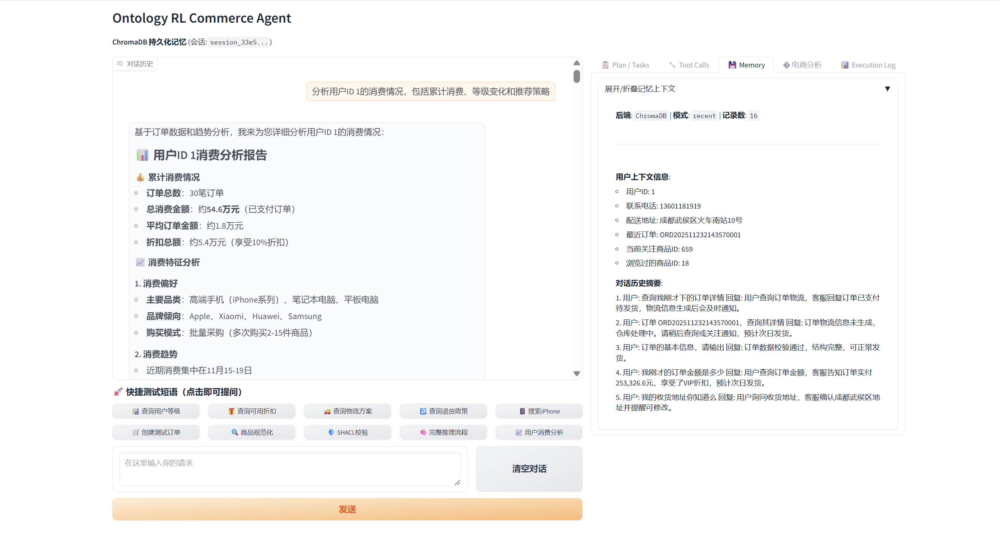
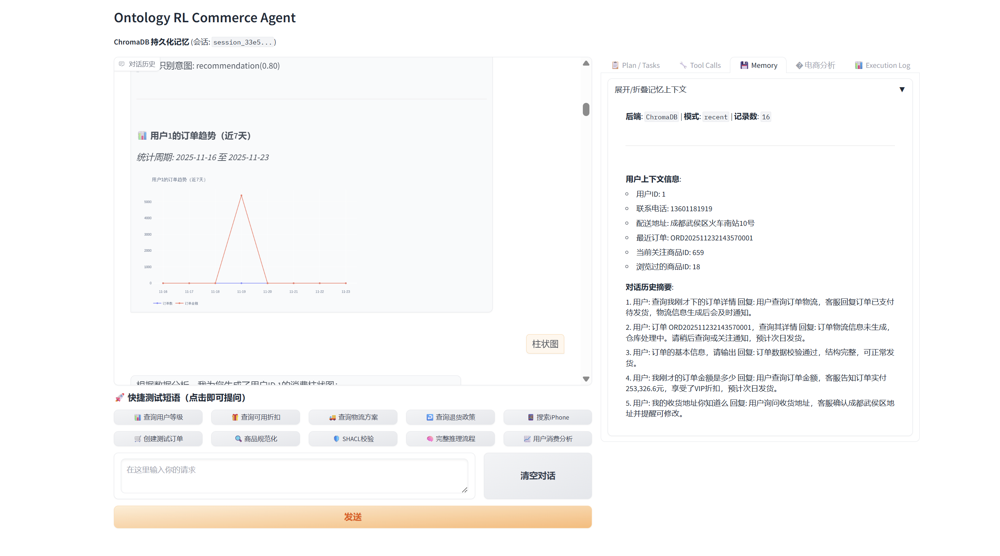
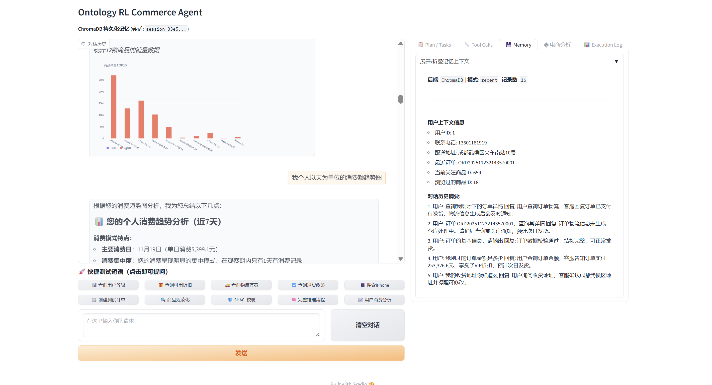
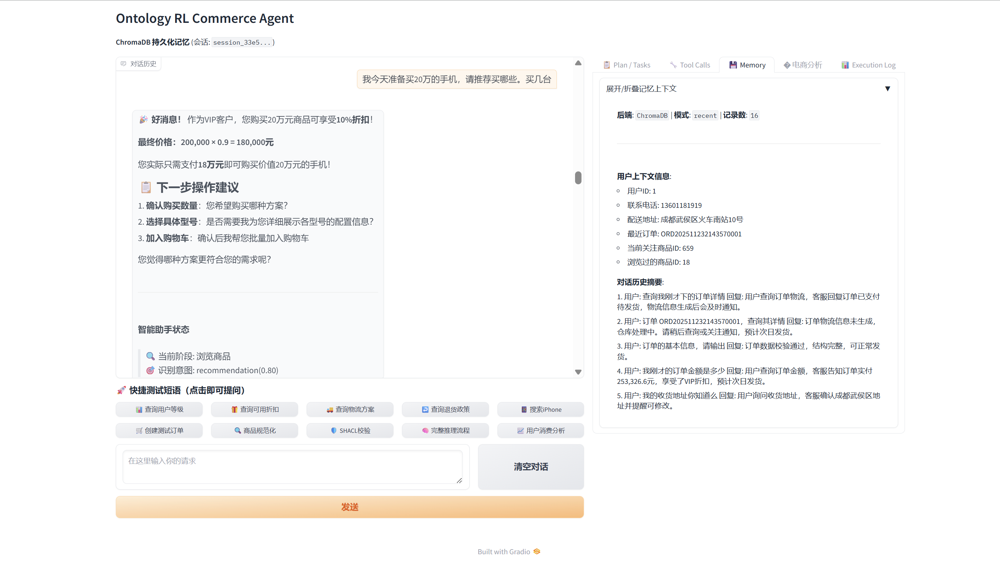
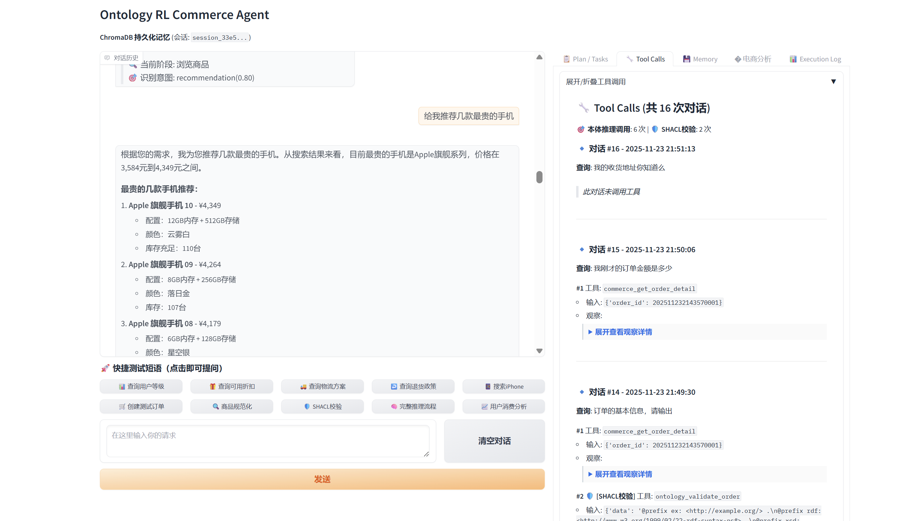
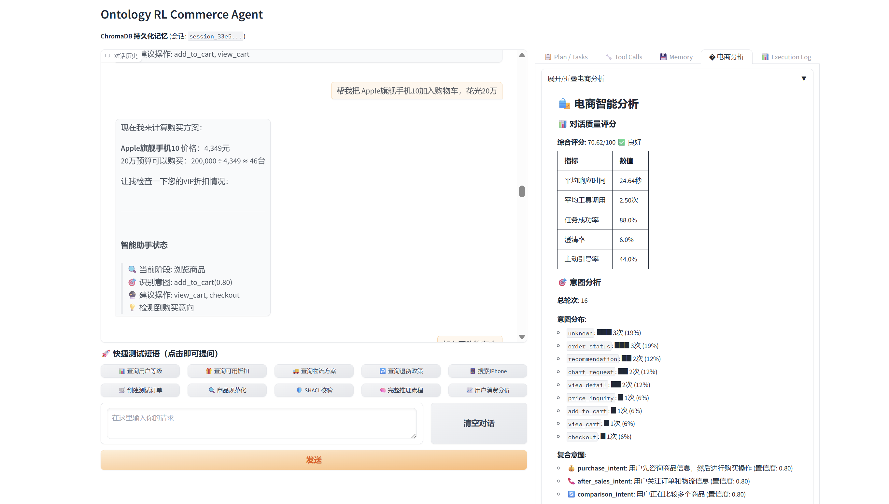
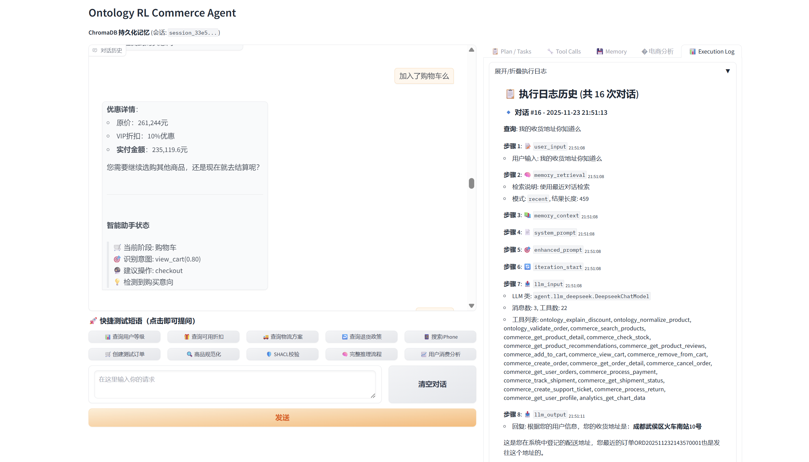
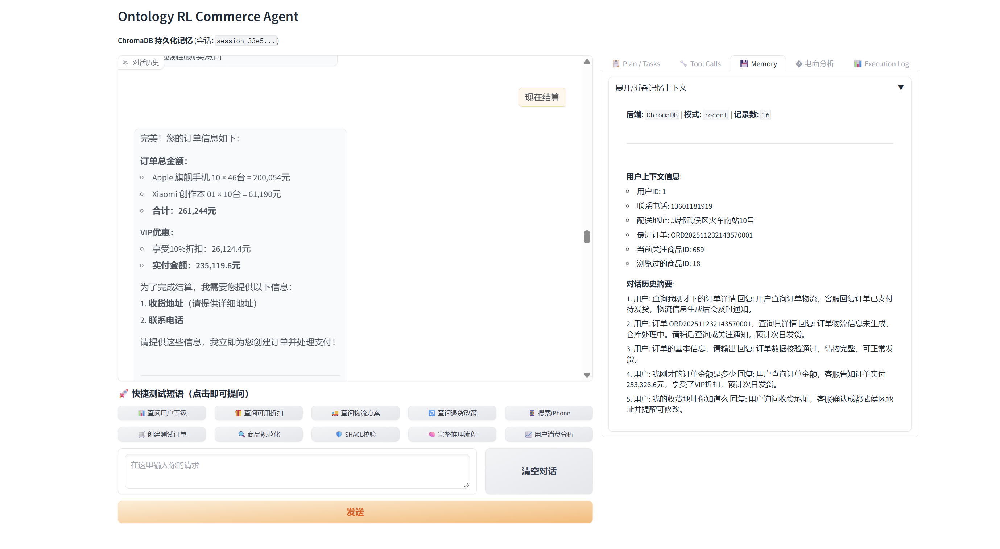
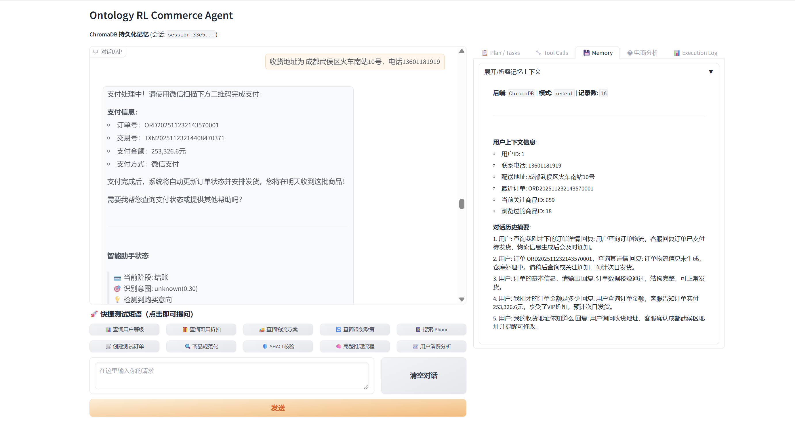

# VIP 客户购机闭环案例（VIP Commerce Case Study)

> A real session (ID: `session_33e54c08`) that shows how the RL Commerce Agent guides a VIP buyer with a ¥200k budget from insight ➜ recommendation ➜ cart ➜ payment ➜ post-sale tracking.

## 场景摘要 · Scenario Snapshot

| 项目 | 详情 |
| --- | --- |
| 用户画像 | ID 1 · VIP 客户 · 近 30 单平均客单价约 ¥18k |
| 预算与目标 | 一次性花费约 ¥200,000 购入最贵的旗舰手机，要求批量下单并走全流程 |
| Agent 能力亮点 | ChromaDB 记忆保持 16 条上下文、22 个工具（含 SHACL 校验）、实时图表、自动折扣策略、订单/物流/支付联动 |
| 关键指标 | 累计消费 ¥546k、可用 10% VIP 折扣、单次推荐可覆盖 46 台 Apple 旗舰机 |

## 对话旅程 · Conversation Timeline

### 1. 画像洞察与记忆回显

- Agent 汇总 30 笔订单、¥546k 累计消费、最近波峰集中在 11 月 15-19 日。
- Memory 面板即刻补充联系方式、地址、最近订单 (`ORD202511232143570001`) 以及对话摘要，后续步骤无需重复确认。 

### 2. 近 7 天订单趋势图

- 通过 trend 图表（analytics 工具生成），用户一眼看到订单频次与 GMV 峰值。
- 该图被自动过滤为“个人数据”，仅在当前对话显示，保护隐私。

### 3. 销量 TOP10 与个人趋势总结

- Agent 同时给出全局 TOP10 柱状图和“个人消费趋势分析”文字，帮助客户对比自身 vs. 品类热度。
- 记忆摘要继续滚动更新，确保后续决策引用到最新指标。

### 4. VIP 采购策略与下一步建议

- Agent 自动计算 10% VIP 折扣，把 ¥200k 预算换算为实付 ¥180k，列出“确认数量 → 选择型号 → 加入购物车”的作业流。
- 意图识别保持在 `recommendation(0.80)`，状态面板提示当前在“浏览商品”阶段。

### 5. 工具链透明度与旗舰机推荐

- Tool Calls 面板展示 16 轮交互、6 次本体推理与 2 次 SHACL 校验；确保每一次价格 / 订单查询都可追溯。
- Agent 给出三款最贵 Apple 旗舰手机（内存、颜色、库存全部溯源），满足“买最贵”的明确需求。

### 6. 预算拆解与意图分析

- 电商智能分析卡片输出综合得分 70.62/100、任务成功率 88%、主导引导率 44%。
- “智能助手状态”识别 `add_to_cart` 意图，并建议下一步执行 `view_cart` / `checkout`，同时记录意图分布（unknown/order_status/recommendation…）。

### 7. 购物车与订单汇总

- 购物车阶段展示原价 ¥261,244、VIP 优惠、实付 ¥235,119.6，并提示可继续挑选或直接结算。
- 执行日志同步展开，逐步列出 memory → prompt → tool → LLM 输出的调用链，方便排错与审计。

### 8. 结算确认

- Agent 汇总 46 台 Apple 旗舰手机 + 10 台 Xiaomi 创作本的组合，并再次索取收货地址/电话做风控确认。
- 继续强调 VIP 折扣金额，避免用户对优惠产生疑问。

### 9. 支付指引与履约跟进

- 即时生成支付二维码与交易号 (`TXN20251123214408470371`)，提示完成后系统会自动推进物流。
- 随后更新订单金额细目、收货地址确认（见 `image-1763910962010.png`、`image-1763910991795.png`），完成售后闭环。

## 经验要点 · Key Takeaways

1. **高记忆密度**：ChromaDB + 16 轮上下文确保多次金额/地址提问保持一致回答。
2. **可解释工具链**：Tool Calls、Execution Log、SHACL 校验让每一步推荐与订单创建都可复盘。
3. **多模态输出**：趋势图、TOP10 柱状图与文字摘要并行，提升信任感。
4. **RL + 业务规则协同**：RL 策略自动识别阶段/意图，业务规则则负责折扣、风控校验，共同完成 VIP 订单闭环。

> 查看更多技术细节：`README.md` / `README.zh.md` 的 “案例展示” 章节会引用本文档与精选截图。
