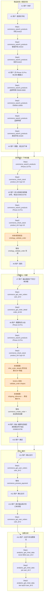

# 14-Round Interaction Flow

下面是 2025-12-25 会话的调用链流程图，涵盖 14 轮对话（用户输入、工具调用、等待节点等）。

```mermaid
flowchart TD
  %% 14-round interaction with subflows + ontology/rule checks
  classDef rule fill:#ffe6cc,stroke:#ff9900,stroke-width:1.5px,color:#663300;
  classDef wait fill:#f2f2f2,stroke:#999,stroke-dasharray: 4 2;
  subgraph P1["商品发现 / 意图识别"]
    direction TB
    D1["#1 用户: 你好"] --> D2["#2 用户: 我想买手机"]
    D2 --> D2s1["Step1: commerce_search_products 手机 limit10"]
    D2s1 --> D2s2["Step2: commerce_search_products 智能手机 limit10"]
    D2s2 --> D2s3["Step3: commerce_search_products 安卓 limit10"]
    D2s3 --> D3["#3 用户: 买 iPhone 15 Pro ¥8,999 数量10"]
    D3 --> D3s1["Step1: commerce_search_products 品牌苹果 价8500-9500"]
    D3s1 --> D3s2["Step2: commerce_search_products 价8000-10000"]
    D3s2 --> D3s3["Step3: commerce_search_products 品牌苹果"]
    D3s3 --> D3s4["Step4: commerce_search_products 类目手机 limit20"]
    D3s4 --> D4["#4 用户: 需要，请立刻下单"]
  end

  subgraph P2["库存核验 / 下单准备"]
    direction TB
    D4 --> D4s1["Step1: commerce_search_products iPhone 15 Pro"]
    D4s1 --> D4s2["Step2: commerce_check_stock product_id=2 qty=10"]
    D4s2 --> D5["#5 用户: 四川武侯区高阳路38号，电话15308215756"]
    D5 --> D5s1["Step1: commerce_search_products iPhone 15 Pro"]
    D5s1 --> D5s2["Step2: commerce_check_stock product_id=2 qty=10"]
    D5s2 --> D5rule["本体/规则校验: ontology_validate_order"]
    D5rule --> D5wait["等待: ontology_validate_order 完成"]
    D5wait --> D6["#6 用户: 是的"]
  end

  subgraph P3["订单确认 / 创建"]
    direction TB
    D6 --> D7["#7 用户: 输出我刚才下的订单详细"]
    D7 --> D7s1["Step1: commerce_get_user_orders user_id=2"]
    D7s1 --> D7s2["Step2: commerce_get_order_detail order_id=64"]
    D7s2 --> D8["#8 用户: 需要购买10台iPhone 15 Pro"]
    D8 --> D8s1["Step1: commerce_search_products iPhone 15 Pro"]
    D8s1 --> D8s2["Step2: commerce_check_stock product_id=2 qty=10"]
    D8s2 --> D8rule1["本体推理: infer_order_details 折扣/运费/SVIP 等级"]
    D8rule1 --> D8rule2["SHACL 校验: validate_order shapes"]
    D8rule2 --> D8ship["本体推理: shipping_inference → 承运商/ETA"]
    D8ship --> D8wait["等待: commerce_create_order + 自动物流创建"]
    D8wait --> D9["#9 用户: 地址 成都市武侯区高阳路38号 电话15308215756"]
    D9 --> D10["#10 用户: 确定"]
  end

  subgraph P4["支付 / 履约"]
    direction TB
    D10 --> D11["#11 用户: 确认支付"]
    D11 --> D11s1["Step1: commerce_get_user_orders user_id=2"]
    D11s1 --> D11wait["等待: commerce_process_payment"]
    D11wait --> D12["#12 用户: 确认支付"]
    D12 --> D13["#13 用户: 再次输出刚才的订单详情"]
    D13 --> D13s1["Step1: commerce_get_user_orders user_id=2"]
  end

  subgraph P5["消费分析"]
    direction TB
    D13s1 --> D14["#14 用户: 分析今年消费情况"]
    D14 --> D14s1["Step1: analytics_get_chart_data trend 365d user_id=2"]
    D14s1 --> D14s2["Step2: analytics_get_chart_data pie user_id=2"]
    D14s2 --> D14s3["Step3: analytics_get_chart_data bar top10 user_id=2"]
  end

  %% cross-phase edges (for clarity)
  P1 --> P2
  P2 --> P3
  P3 --> P4
  P4 --> P5

  %% styling
  class D5rule rule;
  class D5wait wait;
  class D8rule1,D8rule2,D8ship rule;
  class D8wait wait;
```

> 提示：在支持 Mermaid 的 Markdown 查看器中打开可视化流程图。如果需要拆分子流程（下单、支付、分析）或补充本体推理/规则校验节点，可在此文档继续追加子图。
