# Interaction Sequence Diagrams

从 `logs/agent_20251129_150222.log` 与 `logs/server_20251129_150222.log` 提取的一次完整电商对话，共拆分为 5 段子会话。每段对应一次用户输入及其触发的工具链路，便于逐段排查。

> 说明：图中以 `rect rgba(255,196,132,0.35)`（浅橙色）高亮的区域，表示该步骤触发了本体规则推理或 SHACL 校验。

## Conversation 1 – 初始推荐（15:02:53-15:03:35）
- 用户请求“推荐 10 款好的电子产品”，Agent 进入 streaming 模式。
- Intent Tracker 判定为 `recommendation`，Query Rewriter 将“电子产品”扩展为手机/电脑/耳机等关键词。
- Agent 连续 8 次调用 `commerce.search_products`（FTS5 → 回退）并把结果通过 DeepSeek LLM 流式返回。
- 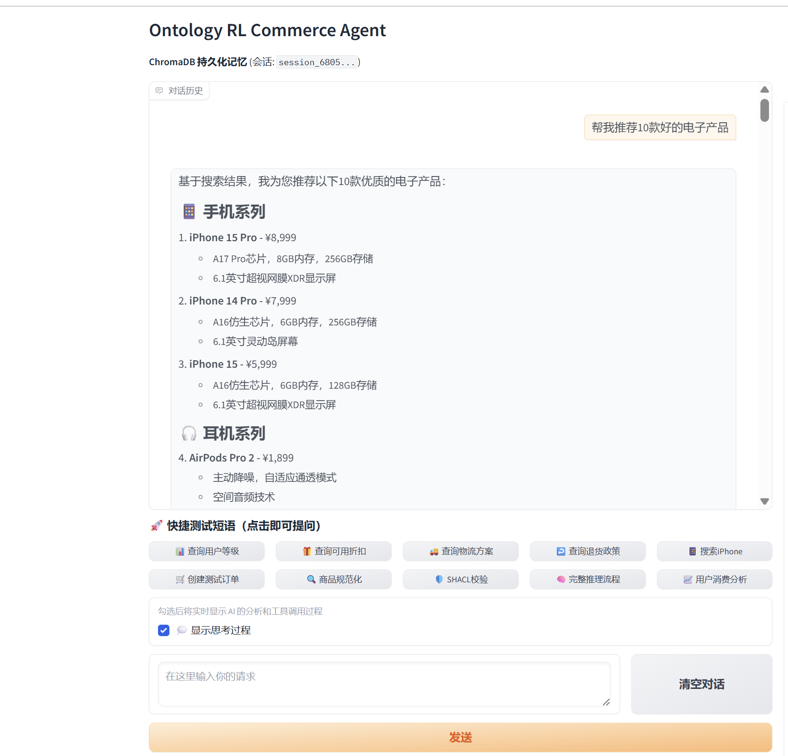

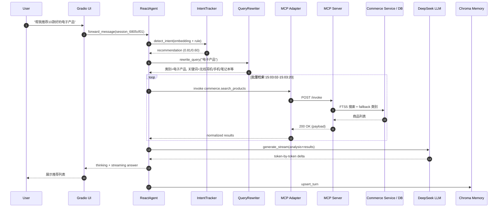
```mermaid
sequenceDiagram
    autonumber
    participant User
    participant UI as Gradio UI
    participant Agent as ReactAgent
    participant Intent as IntentTracker
    participant Rewrite as QueryRewriter
    participant MCP as MCP Adapter
    participant Server as MCP Server
    participant Commerce as Commerce Service / DB
    participant LLM as DeepSeek LLM
    participant Memory as Chroma Memory

    User->>UI: "帮我推荐10款好的电子产品"
    UI->>Agent: forward_message(session_6805cf01)
    Agent->>Intent: detect_intent(embedding + rule)
    Intent-->>Agent: recommendation (0.81/0.60)
    Agent->>Rewrite: rewrite_query("电子产品")
    Rewrite-->>Agent: 类别=电子产品, 关键词=无线耳机/手机/笔记本等
    loop 批量检索 15:03:02-15:03:20
        Agent->>MCP: invoke commerce.search_products
        MCP->>Server: POST /invoke
        Server->>Commerce: FTS5 搜索 + fallback 类别
        Commerce-->>Server: 商品列表
        Server-->>MCP: 200 OK (payload)
        MCP-->>Agent: normalized results
    end
    Agent->>LLM: generate_stream(analysis+results)
    LLM-->>Agent: token-by-token delta
    Agent-->>UI: thinking + streaming answer
    UI-->>User: 展示推荐列表
    Agent->>Memory: upsert_turn #1
```

## Conversation 2 – 追加检索与价格询问（15:04:10-15:06:04）
- 用户依次输入“还有没有其他的 / 更便宜点 / 最便宜和最贵的”。
- Intent 切换在 `search` 与 `price_inquiry` 之间，Query Rewriter 采用 hybrid/broad 策略。
- `commerce.search_products` 调用附带价格/类别过滤，FTS5 命中失败时回退到 LIKE/类别。

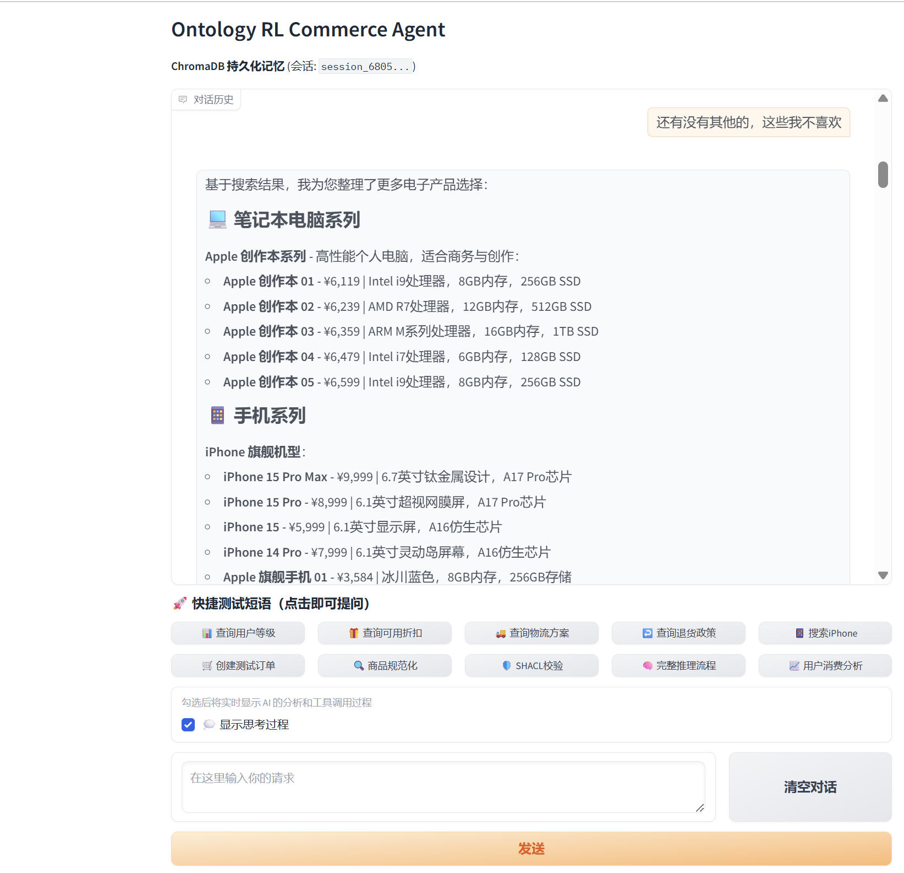

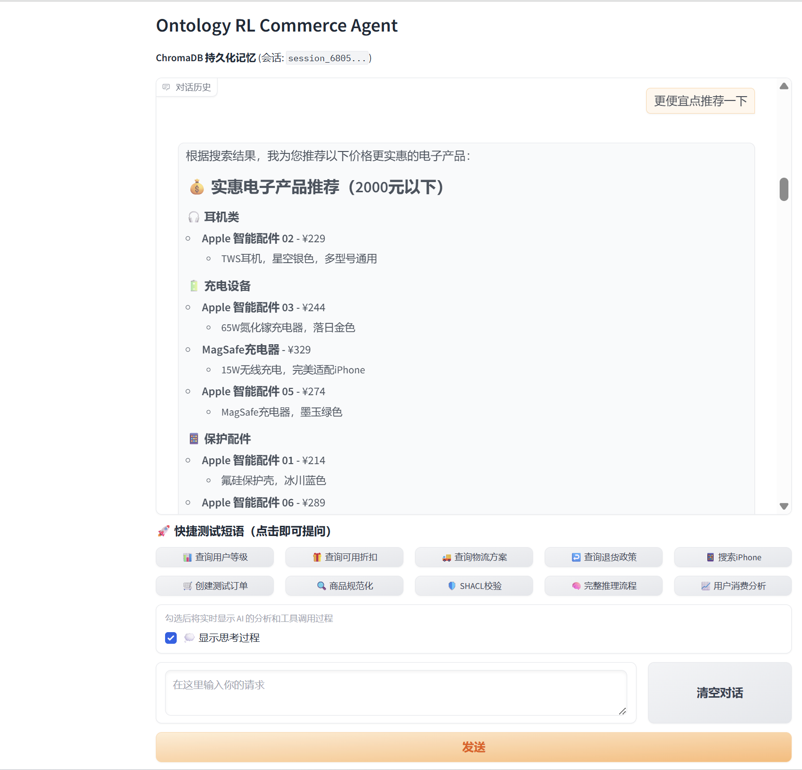

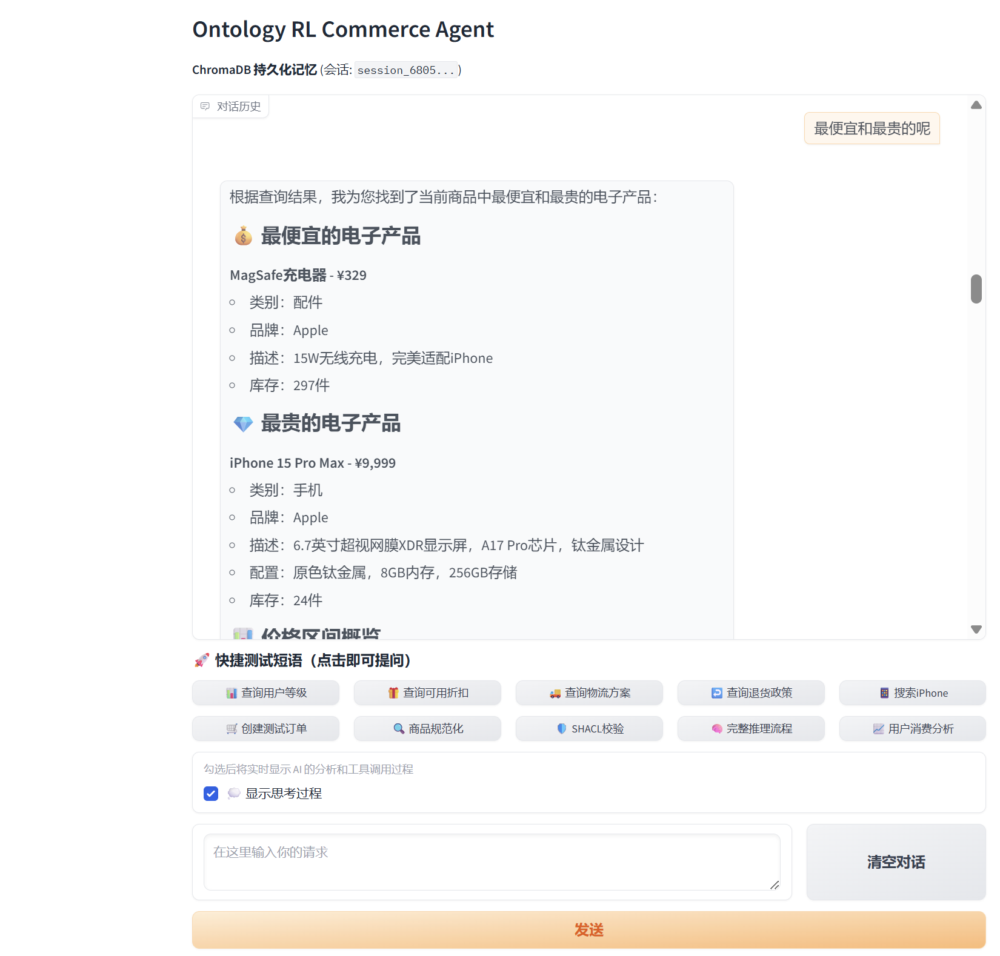

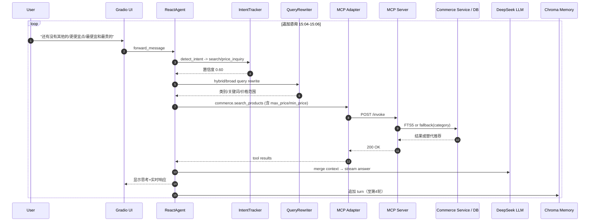
```mermaid
sequenceDiagram
    autonumber
    participant User
    participant UI as Gradio UI
    participant Agent as ReactAgent
    participant Intent as IntentTracker
    participant Rewrite as QueryRewriter
    participant MCP as MCP Adapter
    participant Server as MCP Server
    participant Commerce as Commerce Service / DB
    participant LLM as DeepSeek LLM
    participant Memory as Chroma Memory

    loop 追加咨询 15:04-15:06
        User->>UI: "还有没有其他的/更便宜点/最便宜和最贵的"
        UI->>Agent: forward_message
        Agent->>Intent: detect_intent -> search/price_inquiry
        Intent-->>Agent: 置信度 0.60
        Agent->>Rewrite: hybrid/broad query rewrite
        Rewrite-->>Agent: 类别/关键词/价格范围
        Agent->>MCP: commerce.search_products (含 max_price/min_price)
        MCP->>Server: POST /invoke
        Server->>Commerce: FTS5 or fallback(category)
        Commerce-->>Server: 结果或替代推荐
        Server-->>MCP: 200 OK
        MCP-->>Agent: tool results
        Agent->>LLM: merge context → stream answer
        Agent-->>UI: 显示思考+实时响应
        Agent->>Memory: 追加 turn（至第4轮）
    end
```

## Conversation 3 – 下单与支付（15:08:25-15:11:18）
- 用户提供 UserID，要求“清空购物车重新添加 MagSafe 充电器和 iPhone 15 Pro Max”，并给出收货地址+电话。
- Agent 先查看购物车，再批量调用 remove/add_to_cart，随后 create_order → process_payment。
- Commerce Service 内部完成本体推理、SHACL 校验、库存与累计消费更新。

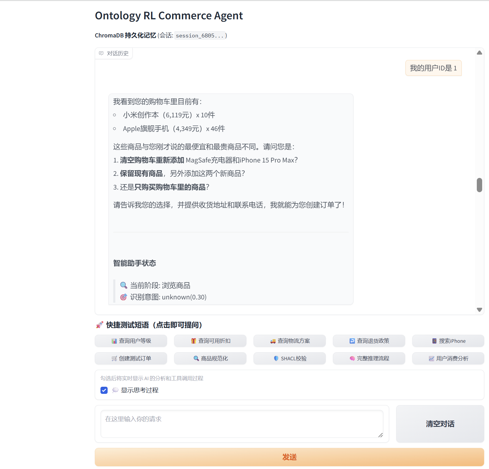

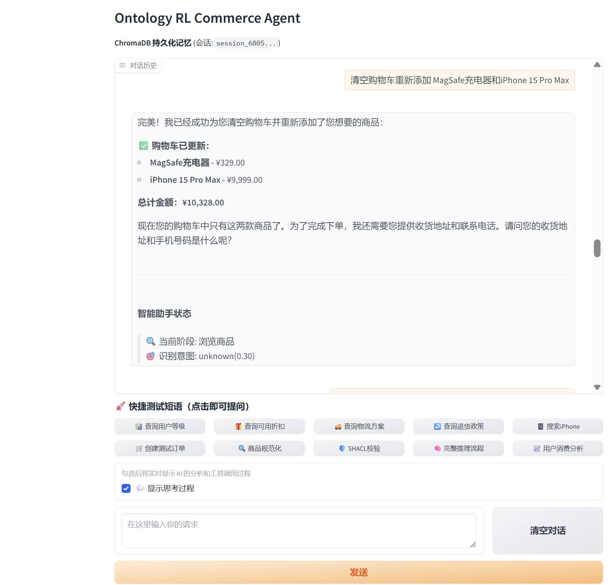

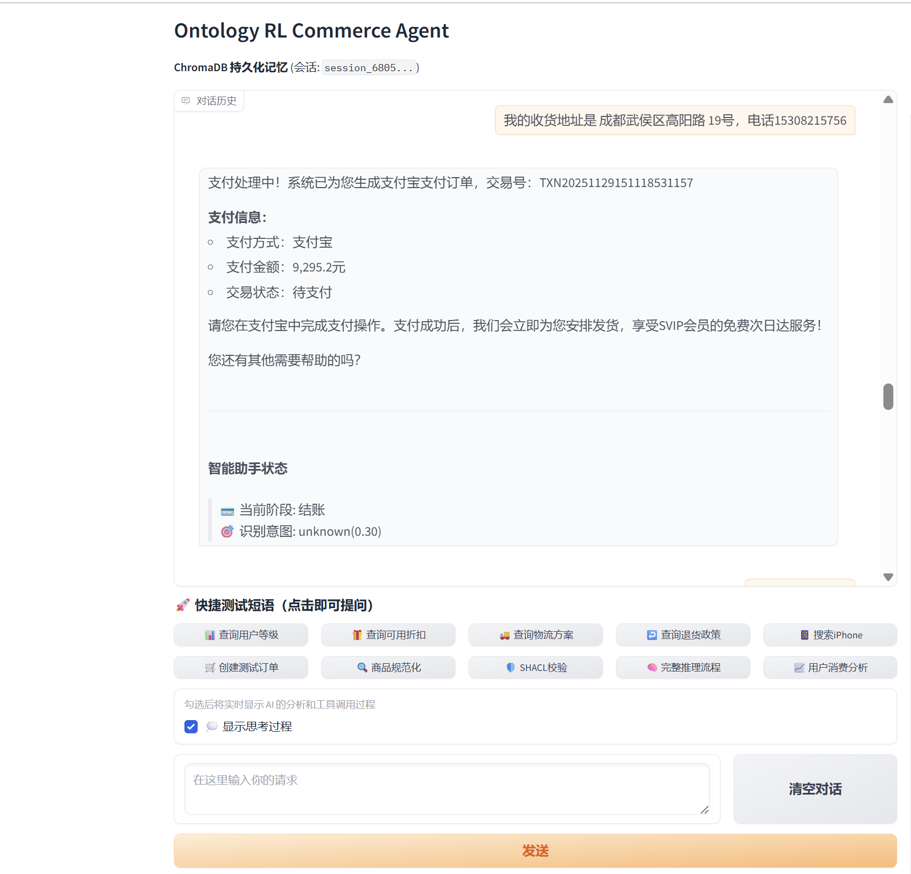
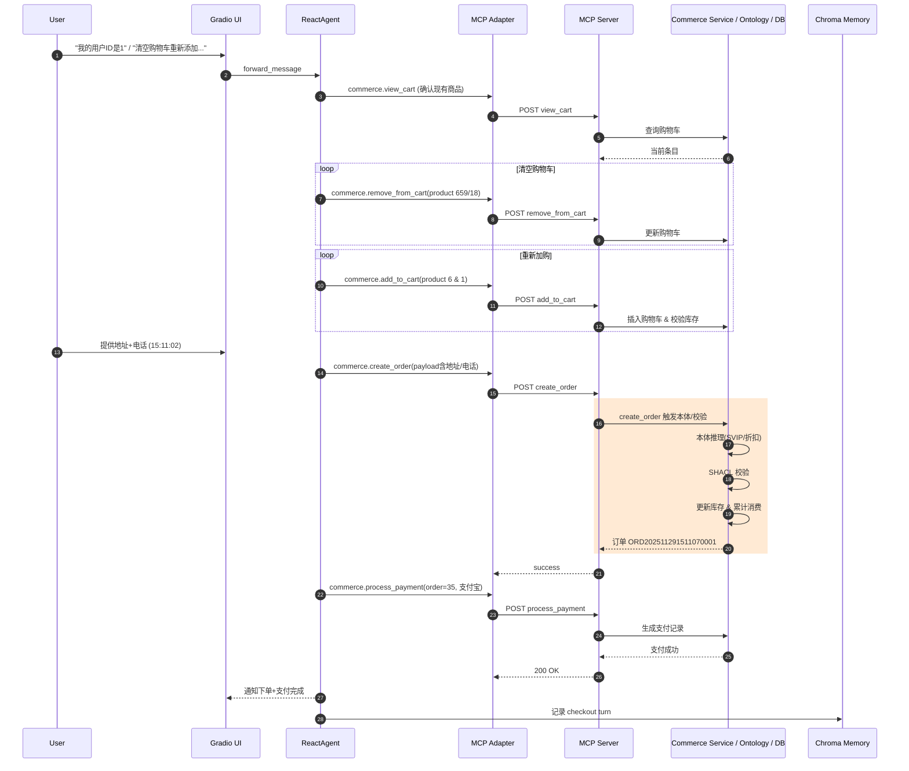
```mermaid
sequenceDiagram
    autonumber
    participant User
    participant UI as Gradio UI
    participant Agent as ReactAgent
    participant MCP as MCP Adapter
    participant Server as MCP Server
    participant Commerce as Commerce Service / Ontology / DB
    participant Memory as Chroma Memory

    User->>UI: "我的用户ID是1" / "清空购物车重新添加..."
    UI->>Agent: forward_message
    Agent->>MCP: commerce.view_cart (确认现有商品)
    MCP->>Server: POST view_cart
    Server->>Commerce: 查询购物车
    Commerce-->>Server: 当前条目
    loop 清空购物车
        Agent->>MCP: commerce.remove_from_cart(product 659/18)
        MCP->>Server: POST remove_from_cart
        Server->>Commerce: 更新购物车
    end
    loop 重新加购
        Agent->>MCP: commerce.add_to_cart(product 6 & 1)
        MCP->>Server: POST add_to_cart
        Server->>Commerce: 插入购物车 & 校验库存
    end
    User->>UI: 提供地址+电话 (15:11:02)
    Agent->>MCP: commerce.create_order(payload含地址/电话)
    MCP->>Server: POST create_order
    rect rgba(255,196,132,0.35)
        Server->>Commerce: create_order 触发本体/校验
        Commerce->>Commerce: 本体推理(SVIP/折扣)
        Commerce->>Commerce: SHACL 校验
        Commerce->>Commerce: 更新库存 & 累计消费
        Commerce-->>Server: 订单 ORD202511291511070001
    end
    Server-->>MCP: success
    Agent->>MCP: commerce.process_payment(order=35, 支付宝)
    MCP->>Server: POST process_payment
    Server->>Commerce: 生成支付记录
    Commerce-->>Server: 支付成功
    Server-->>MCP: 200 OK
    Agent-->>UI: 通知下单+支付完成
    Agent->>Memory: 记录 checkout turn
```

## Conversation 4 – 支付确认与售后查询（15:12:06-15:15:40）
- 用户声明“我已经支付完毕”，Agent 检查物流状态，结果因未生成发货信息返回 400。
- 随后用户多次查询订单详情、地址、联系电话，Agent 通过 `get_user_orders` / `get_order_detail` / `get_user_profile` 获取数据。

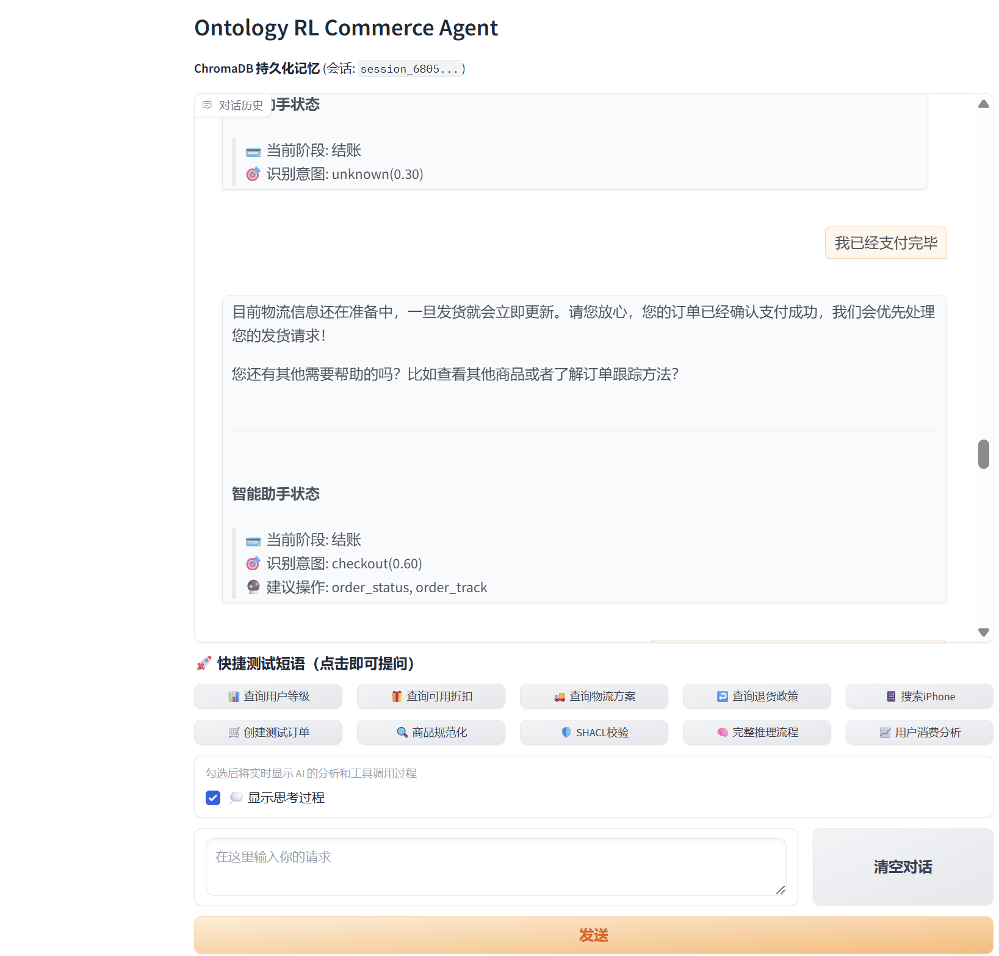

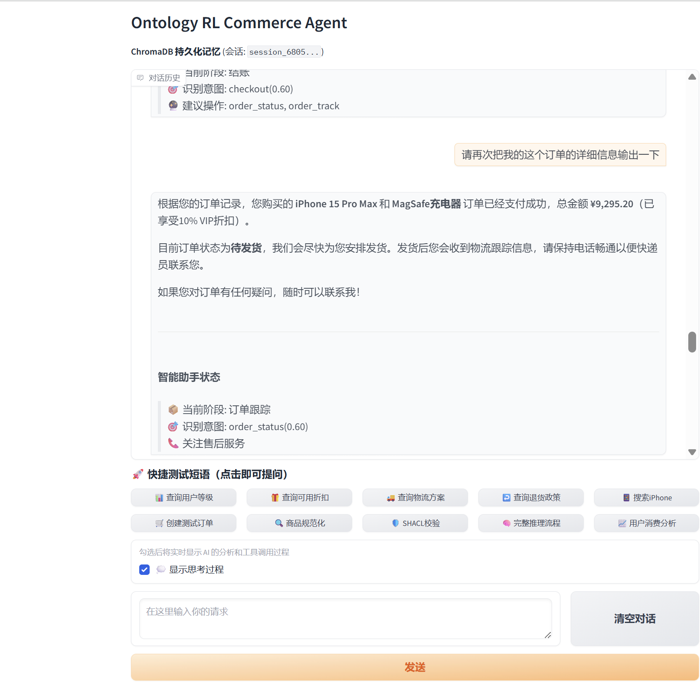

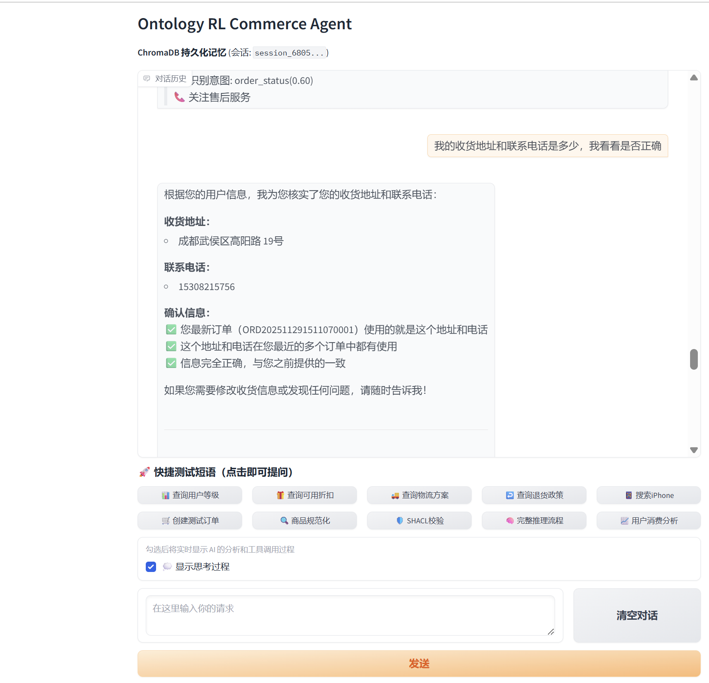
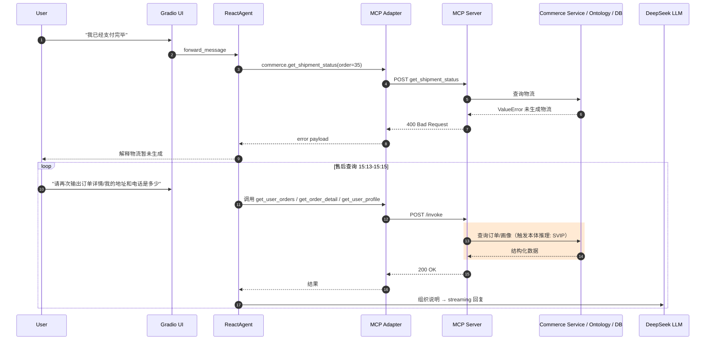
```mermaid
sequenceDiagram
    autonumber
    participant User
    participant UI as Gradio UI
    participant Agent as ReactAgent
    participant MCP as MCP Adapter
    participant Server as MCP Server
    participant Commerce as Commerce Service / Ontology / DB
    participant LLM as DeepSeek LLM

    User->>UI: "我已经支付完毕"
    UI->>Agent: forward_message
    Agent->>MCP: commerce.get_shipment_status(order=35)
    MCP->>Server: POST get_shipment_status
    Server->>Commerce: 查询物流
    Commerce-->>Server: ValueError 未生成物流
    Server-->>MCP: 400 Bad Request
    MCP-->>Agent: error payload
    Agent-->>User: 解释物流暂未生成
    loop 售后查询 15:13-15:15
        User->>UI: "请再次输出订单详情/我的地址和电话是多少"
        Agent->>MCP: 调用 get_user_orders / get_order_detail / get_user_profile
        MCP->>Server: POST /invoke
        rect rgba(255,196,132,0.35)
            Server->>Commerce: 查询订单/画像（触发本体推理: SVIP）
            Commerce-->>Server: 结构化数据
        end
        Server-->>MCP: 200 OK
        MCP-->>Agent: 结果
        Agent->>LLM: 组织说明 → streaming 回复
    end
```

## Conversation 5 – 订单统计与图表（15:16:36-15:17:46）
- 用户想了解“我一共有多少订单，一共消费多少钱”。
- Agent 先查用户订单，再触发 Analytics Service 生成饼图与柱状图，并在 UI 中以 Markdown 图片展示。

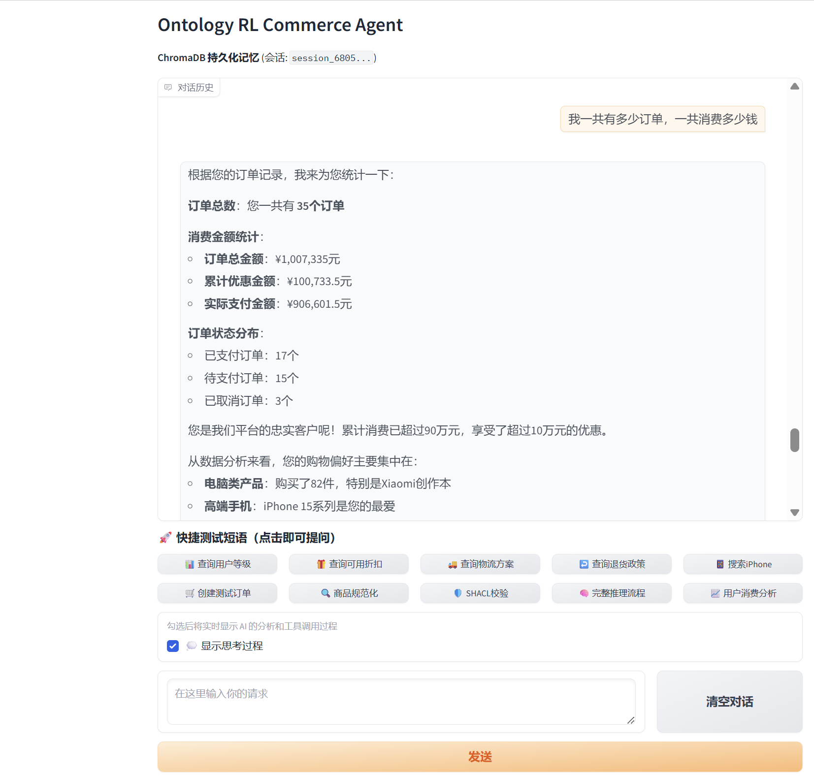

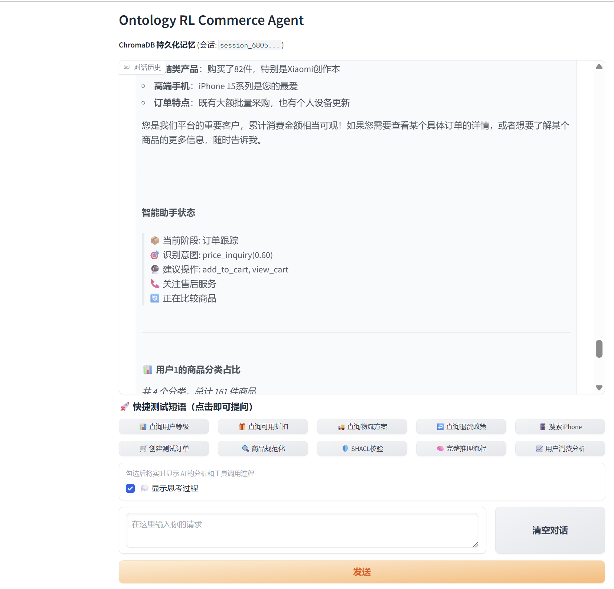

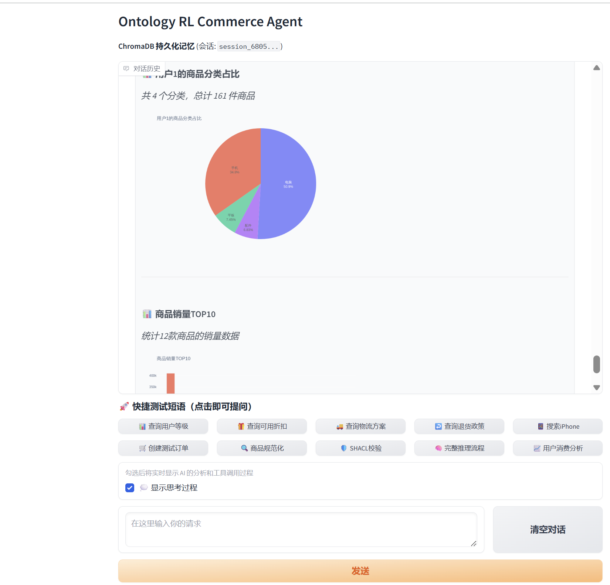

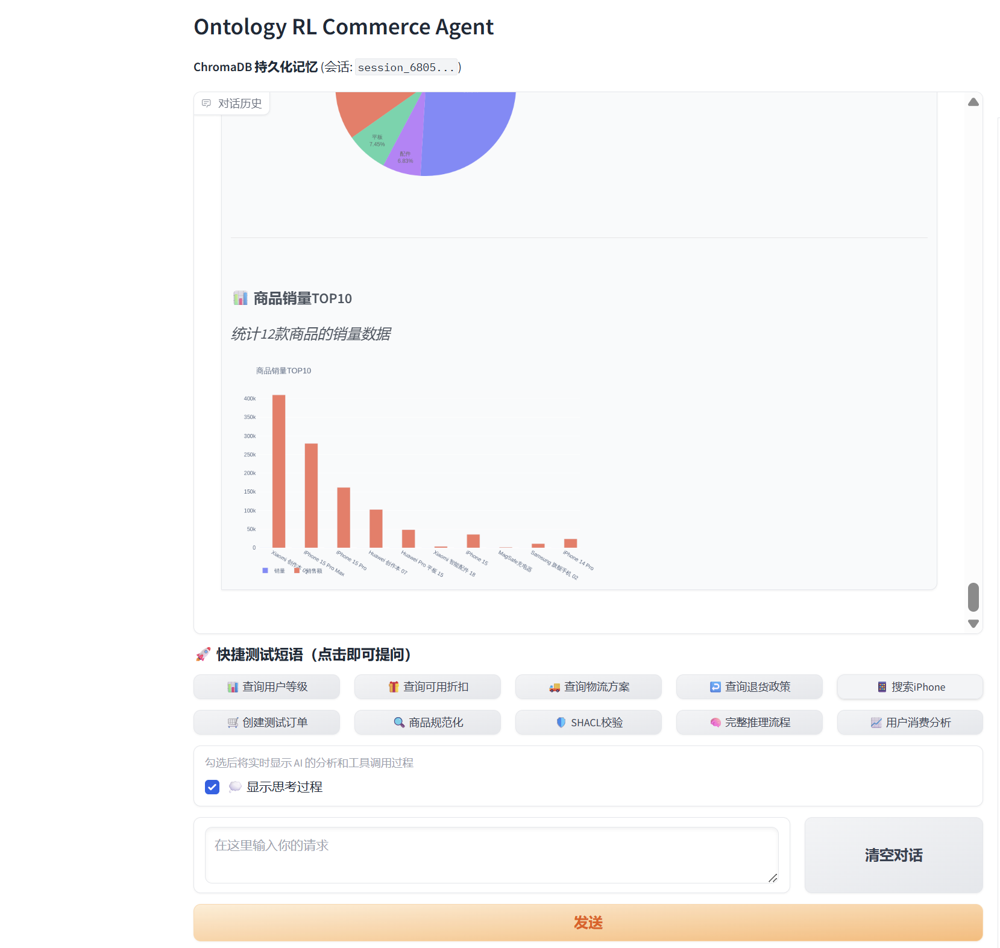
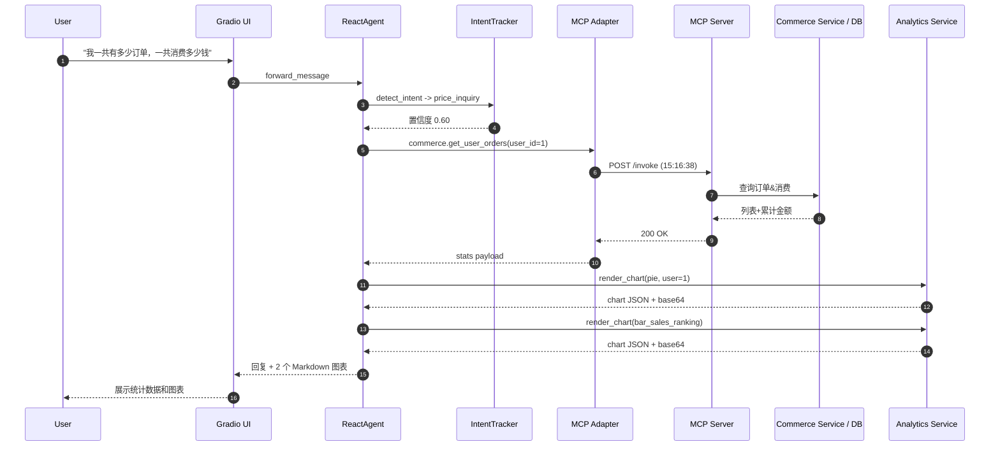
```mermaid
sequenceDiagram
    autonumber
    participant User
    participant UI as Gradio UI
    participant Agent as ReactAgent
    participant Intent as IntentTracker
    participant MCP as MCP Adapter
    participant Server as MCP Server
    participant Commerce as Commerce Service / DB
    participant Analytics as Analytics Service

    User->>UI: "我一共有多少订单，一共消费多少钱"
    UI->>Agent: forward_message
    Agent->>Intent: detect_intent -> price_inquiry
    Intent-->>Agent: 置信度 0.60
    Agent->>MCP: commerce.get_user_orders(user_id=1)
    MCP->>Server: POST /invoke (15:16:38)
    Server->>Commerce: 查询订单&消费
    Commerce-->>Server: 列表+累计金额
    Server-->>MCP: 200 OK
    MCP-->>Agent: stats payload
    Agent->>Analytics: render_chart(pie, user=1)
    Analytics-->>Agent: chart JSON + base64
    Agent->>Analytics: render_chart(bar_sales_ranking)
    Analytics-->>Agent: chart JSON + base64
    Agent-->>UI: 回复 + 2 个 Markdown 图表
    UI-->>User: 展示统计数据和图表
```
